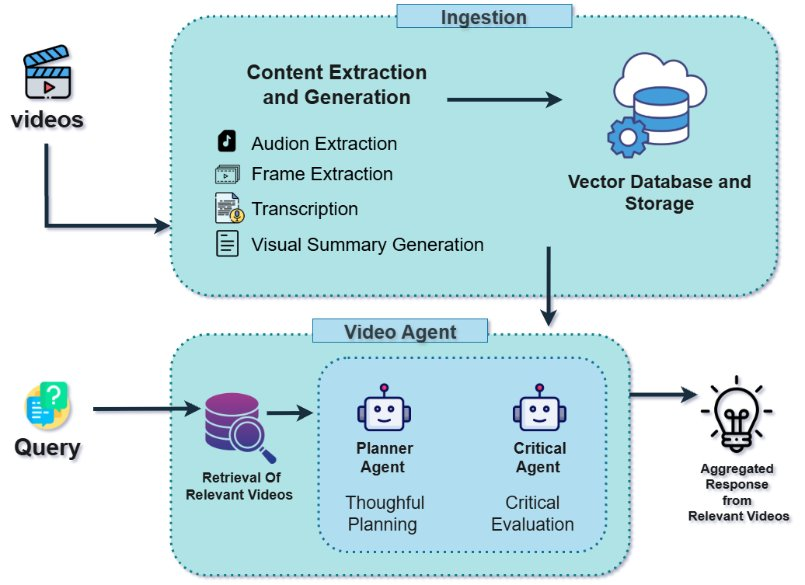
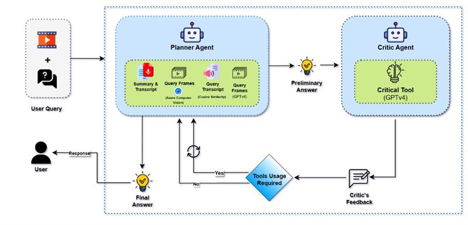

<div align="center">


</div>

# [**MMCT Agent**](https://arxiv.org/pdf/2405.18358) | [***Demo Video***]
[(docs/multimedia/videos/Demo_MMCT.mp4)


## **Overview**

This repository implements **MMCTAgent**, a novel **multi-modal critical thinking agent** designed to push the boundaries of visual reasoning and deep understanding across **images** and **videos**. Built upon our [research paper](https://arxiv.org/pdf/2405.18358), MMCTAgent combines planning, self-critique, and tool-based reasoning to enhance decision-making in complex multi-modal tasks.

[](https://arxiv.org/pdf/2405.18358)

## **Key Features**

### Critical Thinking Architecture

MMCTAgent is inspired by human cognitive processes and integrates a structured reasoning loop:

- **Planner**:  
  Generates an initial response using relevant tools for visual or multi-modal inputs.

- **Critic** *(optional)*:  
  Evaluates the Planner’s response and provides feedback to improve accuracy and decision-making.  
  > The Critic is enabled by default. To disable, set `use_critic_agent=False`.

---

### Modular Agents

MMCTAgent includes two specialized agents:

#### ImageAgent


A reasoning engine tailored for static image understanding.  
It supports a configurable set of tools via the `ImageQnaTools` enum:

- `OBJECT_DETECTION` – Detects objects in the image.
- `OCR` – Extracts embedded text content.
- `RECOG` – Recognizes scenes, faces, or objects.
- `VIT` – Applies GPT-4V for high-level visual reasoning.

> The Critic can be toggled via `use_critic_agent` flag.

---

#### VideoAgent

Optimized for deep video understanding through a structured two-stage pipeline:

1. **Video Retrieval**  
   Uses an Azure AI Search index to fetch videos relevant to a user query.

2. **Video Question Answering**  



   Applies a fixed toolchain orchestrated by the Planner:

   - `GET_SUMMARY_TRANSCRIPT` – Extracts transcript and visual summary.
   - `QUERY_SUMMARY_TRANSCRIPT` – Finds top-3 relevant timestamps.
   - `QUERY_AZURE_COMPUTER_VISION` *(optional)* – Identifies visual cues.
   - `QUERY_GPT4V` – Combines frame-level visual and textual analysis.

> The Critic agent helps validate and refine answers, improving reasoning depth.

For more details, refer to the full research article:

**[MMCTAgent: Multi-modal Critical Thinking Agent
 Framework for Complex Visual Reasoning](https://arxiv.org/abs/2405.18358)**  
Published on **arXiv** – [arxiv.org/abs/2405.18358](https://arxiv.org/abs/2405.18358)

---

## **Table of Contents**

- [Getting Started](#getting-started)
- [Installation](#installation)
- [Prerequisites](#prerequisites)
- [Usage](#usage)
- [Project Structure](#project-structure)

---

## **Getting Started**

To get started with this repository:

1. **Clone the repository**

   ```sh
   git clone --branch <branch-name> <repository-url>
   cd <project-directory>
    ```

2. **FFMPEG Installation**
    - For Linux Environment:

    ```bash
    apt-get update && apt-get install ffmpeg libsm6 libxext6  -y
    ```

    - For Windows:
        - Download FFmpeg from: <https://ffmpeg.org/download.html>
        - Choose the Windows build (e.g., from <https://www.gyan.dev/ffmpeg/builds/> )
        - Extract the files and add the bin folder to the system PATH variable so you can use ffmpeg from the command line.

    LibSM6 & libXext6 (Linux X11 Libraries): These libraries are mainly used for graphical applications on Linux and are not typically required on Windows.

3. **Install MiniConda [If Conda Environment is preferred]**

    You can refer to this [link](https://www.anaconda.com/docs/getting-started/miniconda/install)  for installation of Miniconda, according to your device configuration.

4. **Create the environment**

    You can use conda or venv.
    - **Installation Using Conda**

        ```bash
        conda create -n <env-name> python=3.11.11
        conda activate <env-name>
        ```

    - **Using venv (Python standard)**

        ```bash
        python -m venv <env-name>
        source <env-name>/bin/activate    # on Linux/Mac
        <env-name>\Scripts\activate.bat   # on Windows
        ```

5. **Install dependencies and set up the project**

    Ensure you have pip >= 21.3 to support pyproject.toml installations.

    ```bash
    pip install --upgrade pip
    pip install -r requirements.txt
    ```

## **Prerequisites**

Below are the Azure Resources that are required to execute this repository. You can checkout the `infra` folder and utilize the `INFRA_DEPLOYMENT_GUIDE` to not only deploy the resources through ARM Templates but also build the containers and directly deploy the script to Azure App Services and Azure Container Apps.

| Resource Name                 | Documentation Article | Microsoft Intra-Identity Role |
|--------------------------------|----------------------|------------------------------------|
| Storage Account                | [Document](https://learn.microsoft.com/en-us/azure/storage/common/storage-account-overview)        | *Storage Blob Data Reader/Contributor* |
| Azure Computer Vision  [Optional]        | [Document](https://learn.microsoft.com/en-us/azure/ai-services/computer-vision/)        | *Cognitive Services User*           |
| Azure OpenAI (4o, 4o-mini, text-embedding-ada-002, Whisper) | [Document](https://learn.microsoft.com/en-us/azure/ai-services/openai/) | *Cognitive Services OpenAI User* |
| Azure AI Search                | [Document](https://learn.microsoft.com/en-us/azure/search/)        | *Search Index Data Contributor*       |
| Azure AI Search                | [Document](https://learn.microsoft.com/en-us/azure/search/)        | *Search Service Contributor*       |
| Azure Speech Service           | [Document](https://learn.microsoft.com/en-us/azure/ai-services/speech-service/)        | *Cognitive Services Speech Contributor* or *Cognitive Services Speech User* role.          |
| Azure App Service [Optional] | [Document](https://learn.microsoft.com/en-us/azure/app-service/)        | NA             |
| Azure Event Hub [Optional] | [Document](https://learn.microsoft.com/en-us/azure/app-service/)        | *Azure Event Hubs Data Owner* |
| Azure Container Registry [Optional] | [Document](https://learn.microsoft.com/en-us/azure/container-registry/) | *Reader or Contributor* |
| Application Insights [Optional]          | [Document](https://learn.microsoft.com/en-us/azure/azure-monitor/app/app-insights-overview)        | N/A                                |

> Note: If you want to utilize the Microsoft Azure Intra Id Access then you can assign the above corresponding roles for the each resource. Otherwise you can use the API Key or Connection String approach to utilize the resources.

## **Usage**

You can refer to the `examples` directory to understand the usage of this repository. Below are the sample scripts you can refer to get started:

> MMCT Image Agent

```python
from mmct.image_pipeline import ImageAgent, ImageQnaTools
import asyncio
import ast

# user query
query = "" 
# define the tools, you can refer to the Enum definition of Tools to get the idea for available tools
tools = [ImageQnaTools.OBJECT_DETECTION, ImageQnaTools.VIT]
# flag variable whether you want to initialize Critic Agent or not.
use_critic_agent = True
# flag variable whether you have to stream or not.
stream = False
# initialize the Image Agent.
mmct_agent = ImageAgent(
    query=query,
    image_path=image_path,
    tools=tools,
    use_critic_agent=use_critic_agent,
    stream=stream,
)

response = asyncio.run(mmct_agent())
print(response.response)
```

> MMCT Video Agent

```python
import asyncio
import ast
from mmct.video_pipeline import VideoAgent

query = ""
index_name = ""  # Azure AI Search index name
top_n = 3  # Number of top results (video ids for MMCT VQnA) to return from the index
use_azure_cv_tool = False   # flag for selection of Azure Computer Vision Tool
use_critic_agent = True     # flag to utilize Critic Agent.
stream = True               # flag to stream the logs of the Agentic Flow.

video_agent = VideoAgent(
    query=query,
    index_name=index_name,
    top_n=top_n,
    use_azure_cv_tool=use_azure_cv_tool,
    use_critic_agent=use_critic_agent,
    stream=stream,
)

response = asyncio.run(video_agent())
print(response)
```

## **Project Structure**

Below is the project structure highlighting the key entry-point scripts for running the three main pipelines— `Image QNA`, `Video Ingestion` and `Video Agent`.

```sh
MMCTAgent
| 
├── infra
|   └── INFRA_DEPLOYMENT_GUIDE.md    # Guide for deployment of Azure Infrastructure 
├── app                              # contains the FASTAPI application over the mmct pipelines.
├── mmct
│   ├── .
│   ├── image_pipeline
│   │   ├── agents
│   │   │    └── image_agent.py      #  Entry point for the MMCT Image Agentic Workflow
│   │   └── README.md                #  Guide for Image Pipeline
│   └── video_pipeline
│       ├── agents
│       │   └── video_agent.py      # Entry point for the MMCT Video Agentic Workflow
│       ├── core
│       │     └── ingestion
│       │           └── ingestion_pipeline.py   # Entry point for the Video Ingestion Workflow
│       └── README.md                # Guide for Video Pipeline  
├── requirements.txt
└──README.md  
```
