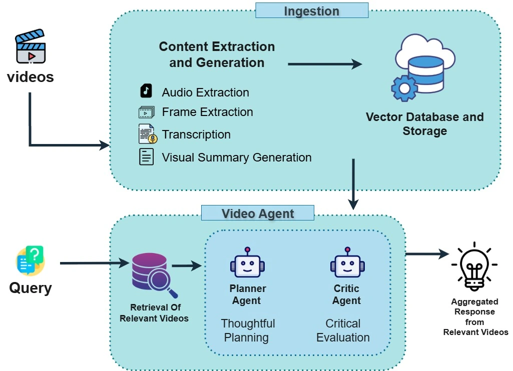
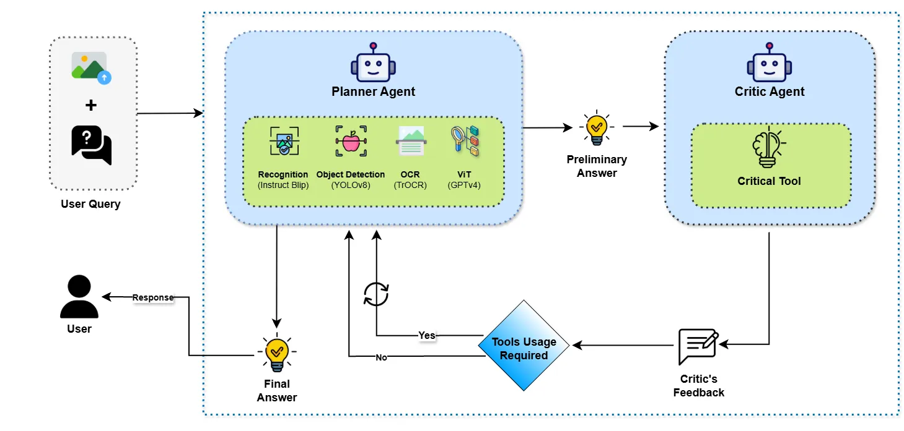
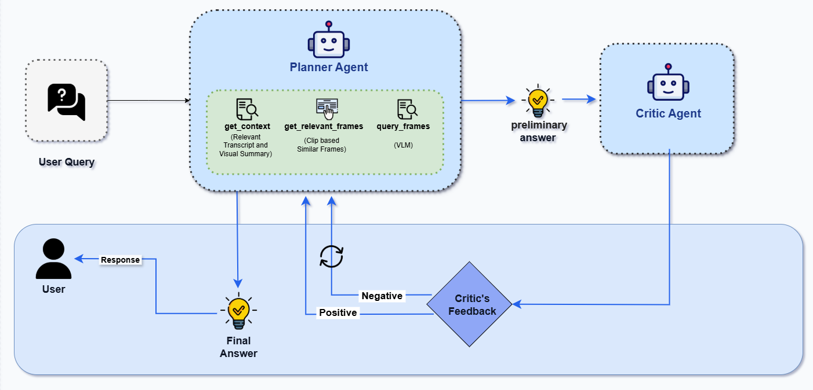

<div align="center">

[](https://arxiv.org/abs/2405.18358)
[](https://opensource.org/licenses/MIT)
[](https://www.python.org/downloads/)

</div>

# [**MMCTAgent**](https://arxiv.org/abs/2405.18358)

<div align="center">
  <strong>Multi-Modal Critical Thinking Agent Framework for Complex Visual Reasoning</strong>
  <br><br>
  <a href="https://youtu.be/Lxt1b_U-a68">🎥 Demo Video</a> • 
  <a href="https://arxiv.org/abs/2405.18358">📄 Research Paper</a> • 
  <a href="#getting-started">🚀 Quick Start</a>
</div>

<br>

<div align="center">


**▶️ [Watch Demo Video](https://youtu.be/Lxt1b_U-a68)**

</div>

## Overview

MMCTAgent is a state-of-the-art multi-modal AI framework that brings human-like critical thinking to visual reasoning tasks. it combines advanced planning, self-critique, and tool-based reasoning to deliver superior performance in complex image and video understanding applications.

### Why MMCTAgent?

- **🧠 Human-Inspired Critical Thinking**: MMCTAgent emulates human cognitive processes by iteratively analyzing multi-modal information, decomposing complex queries, planning strategies, and dynamically evolving its reasoning.
- **🎯 Superior Performance**: Outperforms traditional approaches on complex visual reasoning benchmarks.  
- **🔬 Research-Driven Innovation**: Designed as a research framework, MMCTAgent integrates critical thinking elements such as verification of final answers and self-reflection through a novel approach that defines a vision-based critic and identifies task-specific evaluation criteria, thereby enhancing its decision-making abilities.
- **🚀 Easy Integration**: Its modular design allows for easy integration into existing workflows, facilitating adoption across various domains requiring advanced visual reasoning capabilities.

<p align="center">
  <a href="https://arxiv.org/abs/2405.18358">
    
  </a>
</p>

## **Key Features**

### **Critical Thinking Architecture**

MMCTAgent is inspired by human cognitive processes and integrates a structured reasoning loop:

- **Planner**:  
  Generates an initial response using relevant tools for visual or multi-modal input.

- **Critic**:  
  Evaluates the Planner’s response and provides feedback to improve accuracy and decision-making. 
---

### **Modular Agents**

MMCTAgent includes two specialized agents:

<details>

<summary>ImageAgent</summary>

[](https://arxiv.org/abs/2405.18358)

A reasoning engine tailored for static image understanding.  
It supports a configurable set of tools via the `ImageQnaTools` enum:

- `OBJECT_DETECTION` – Detects objects in an image.
- `OCR` – Extracts embedded text content.
- `RECOG` – Recognizes scenes, faces, or objects.
- `VIT` – Applies GPT-4V for high-level visual reasoning.

> The Critic can be toggled via the `use_critic_agent` flag.

</details>

<details>

<summary>VideoAgent</summary>

Optimized for deep video understanding:

**Video Question Answering**  

[](https://arxiv.org/abs/2405.18358)

   Applies a fixed toolchain orchestrated by the Planner:

- `GET_CONTEXT` – Extracts transcript and visual summary chunks relevant to the query.
- `GET_RELEVANT_FRAMES` – Provides semantically similar keyframes related to the query. This tool is based on the CLIP embedding.
- `QUERY_FRAME` – Queries specific video keyframes to extract detailed information and provide additional visual context to the Planner.

> The Critic agent helps validate and refine answers, improving reasoning depth.

For more details, refer to the full research article:

**[MMCTAgent: Multi-modal Critical Thinking Agent
 Framework for Complex Visual Reasoning](https://arxiv.org/abs/2405.18358)**  
Published on **arXiv** – [arxiv.org/abs/2405.18358](https://arxiv.org/abs/2405.18358)
</details>

---

## **Table of Contents**

- [Getting Started](#getting-started)
- [Provider System](#provider-system)
- [Configuration](#configuration)
- [Project Structure](#project-structure)
- [Contributing](#contributing)
- [Citations](#citation)
- [License](#license)
- [Support](#support)
---

## **Getting Started**

### **Installation**

1. **Clone the Repository**
   ```bash
   git clone https://github.com/microsoft/MMCTAgent.git
   cd MMCTAgent
   ```

2. **System Dependencies**
    
   Install FFmpeg

   **Linux/Ubuntu:**
   ```bash
   sudo apt-get update
   sudo apt-get install ffmpeg libsm6 libxext6 -y
   ```
   
   **Windows:**
   - Download FFmpeg from [ffmpeg.org](https://ffmpeg.org/download.html)
   - Add the `bin` folder to your system PATH

3. **Python Environment Setup**

   **Option A: Using Conda (Recommended)**
   ```bash
   conda create -n mmct-agent python=3.11
   conda activate mmct-agent
   ```

   **Option B: Using venv**
   ```bash
   python -m venv mmct-agent
   # Linux/Mac
   source mmct-agent/bin/activate
   # Windows
   mmct-agent\Scripts\activate.bat
   ```

4. **Install Dependencies**
   ```bash
   pip install --upgrade pip
   pip install -r requirements.txt
   ```

5. **Quick Start Examples**

#### Image Analysis with MMCTAgent

```python
from mmct.image_pipeline import ImageAgent, ImageQnaTools
import asyncio

# Initialize the Image Agent with desired tools
image_agent = ImageAgent(
    query="What objects are visible in this image and what text can you read?",
    image_path="path/to/your/image.jpg",
    tools=[ImageQnaTools.OBJECT_DETECTION, ImageQnaTools.OCR, ImageQnaTools.VIT],
    use_critic_agent=True,  # Enable critical thinking
    stream=False
)

# Run the analysis
response = asyncio.run(image_agent())
print(f"Analysis Result: {response.response}")
```

#### Video Analysis with VideoAgent.

Ingest a video through MMCT Video Ingestion Pipeline.

```python
from mmct.video_pipeline import IngestionPipeline, Languages, TranscriptionServices

ingestion = IngestionPipeline(
    video_path="path-of-your-video",
    index_name="index-name",
    transcription_service=TranscriptionServices.WHISPER, #TranscriptionServices.AZURE_STT
    language=Languages.ENGLISH_INDIA,
)

# Run the ingestion pipeline
await ingestion()
```

Perform Q&A through MMCT's Video Agent.
```python
from mmct.video_pipeline import VideoAgent
import asyncio

# Configure the Video Agent
video_agent = VideoAgent(
    query="input-query",
    index_name="your-index-name",
    video_id=None,  # Optional: specify video ID
    url=None,  # Optional: URL to filter out the search results for given url
    use_critic_agent=True,  # Enable critic agent
    stream=False,  # Stream response
    use_graph_rag=False,  # Optional: use graph RAG
    cache=False  # Optional: enable caching
)

# Execute video analysis
response = await video_agent()
print(f"Video Analysis: {response}")
```

For more comprehensive examples, see the [`examples/`](examples/) directory.

## **Provider System**

### **Multi-Cloud & Vendor-Agnostic Architecture**

MMCTAgent now features a **modular provider system** that allows you to seamlessly switch between different cloud providers and AI services without changing your application code. This makes the framework truly **vendor-agnostic** and suitable for various deployment scenarios.

#### **Supported Providers**

| Service Type | Supported Providers | Use Cases |
|--------------|--------------------|-----------|
| **LLM** | Azure OpenAI, OpenAI | Text generation, chat completion |
| **Search** | Azure AI Search | Document search and retrieval |
| **Transcription** | Azure Speech Services, OpenAI Whisper | Audio-to-text conversion |
| **Storage** | Azure Blob Storage, Local Storage | File storage and management |

For detailed configuration instructions, see our [Provider Configuration Guide](mmct/providers/README.md).

---

## **Configuration**

### System Requirements for CLIP embeddings ([openai/clip-vit-base-patch32](https://huggingface.co/openai/clip-vit-base-patch32))

Minimum (development / small-scale):
- CPU: 4-core modern i5/i7, ~8 GB RAM
- Disk: ~500 MB caching model + image/text data
- GPU: none (works but slow)

Recommended (for decent speed / batching):
- CPU: 8+ cores, 16 GB RAM
- GPU: NVIDIA with ≥ 4-6 GB VRAM (e.g. RTX 2060/3060)
- PyTorch + CUDA installed, with mixed precision support

High-throughput / production (fast, large batches):

- 16+ cores CPU, 32+ GB RAM
- GPU: 8-16 GB+ VRAM, fast memory bandwidth (e.g. RTX 3090, A100)
- Use float16 / bfloat16, efficient batching, parallel preprocessing

### Environment Setup

MMCTAgent uses a flexible configuration system that supports multiple cloud providers. Choose your configuration method:

#### Quick Start - Copy Environment Template

```bash
# For development
cp config/environments/development.env .env

# For production
cp config/environments/production.env .env
```

Then edit `.env` with your specific values.

#### Provider Configuration Examples

**Azure-First Setup:**
```bash
# LLM Configuration
LLM_PROVIDER=azure
LLM_ENDPOINT=https://your-resource.openai.azure.com/
LLM_DEPLOYMENT_NAME=gpt-4o
LLM_MODEL_NAME=gpt-4o
LLM_USE_MANAGED_IDENTITY=true

# Search Configuration
SEARCH_PROVIDER=azure_ai_search
SEARCH_ENDPOINT=https://your-search.search.windows.net
SEARCH_USE_MANAGED_IDENTITY=true
SEARCH_INDEX_NAME=your-index-name

# Storage Configuration
STORAGE_PROVIDER=azure_blob
STORAGE_ACCOUNT_NAME=your-storage-account
STORAGE_USE_MANAGED_IDENTITY=true
```

📖 **For comprehensive configuration options, see our [Provider Configuration Guide](docs/PROVIDERS.md)**

## **Project Structure**

Below is the project structure highlighting the key entry-point scripts for running the three main pipelines— `Image QNA`, `Video Ingestion` and `Video Agent`.

```sh
MMCTAgent
| 
├── infra
|   └── INFRA_DEPLOYMENT_GUIDE.md    # Guide for deployment of Azure Infrastructure 
├── app                              # contains the FASTAPI application over the mmct pipelines.
├── mcp_server
│   ├── main.py                      # you need to run main.py to start MCP server
│   ├── client.py                    # MCP server client to connect to MCP server
│   ├── notebooks/                   # contains the examples to utilize MCP server through different agentic-frameworks
│   └── README.md                    # Guide for MCP server.
├── mmct
│   ├── .
│   ├── image_pipeline
│   │   ├── agents
│   │   │    └── image_agent.py      #  Entry point for the MMCT Image Agentic Workflow
│   │   └── README.md                #  Guide for Image Pipeline
│   └── video_pipeline
│       ├── agents
│       │   └── video_agent.py      # Entry point for the MMCT Video Agentic Workflow
│       ├── core
│       │     └── ingestion
│       │           └── ingestion_pipeline.py   # Entry point for the Video Ingestion Workflow
│       └── README.md                # Guide for Video Pipeline  
├── requirements.txt
└── README.md  
```

## **Contributing**

We welcome contributions from the community! MMCTAgent is an open-source project, and we encourage you to help make it better.

#### Steps to Contribute

1. **Fork the Repository**: Click the "Fork" button on GitHub.
2. **Create a Feature Branch**: `git checkout -b feature/your-feature-name`
3. **Make Changes**: Implement your improvements.
4. **Add Tests**: Ensure your changes are well-tested.
5. **Submit a Pull Request**: Describe your changes and submit them for review.

## **Citation**

If you find MMCTAgent useful in your research, please cite our paper:

```bibtex
@article{kumar2024mmctagent,
  title={MMCTAgent: Multi-modal Critical Thinking Agent Framework for Complex Visual Reasoning},
  author={Kumar, Somnath and Gadhia, Yash and Ganu, Tanuja and Nambi, Akshay},
  journal={arXiv preprint arXiv:2405.18358},
  year={2024},
  url={https://arxiv.org/abs/2405.18358}
}
```

## **License**

This project is licensed under the MIT License - see the [LICENSE](LICENSE) file for details.


## **Support**

- [Documentation](docs/)
- [Report Issues](https://github.com/microsoft/MMCTAgent/issues)
- [Discussions](https://github.com/microsoft/MMCTAgent/discussions)
---

<div align="center">
  <strong>Made with ❤️ by the MMCTAgent Team</strong>
  <br>
  <a href="https://github.com/microsoft/MMCTAgent">⭐ Star us on GitHub</a>
</div>
