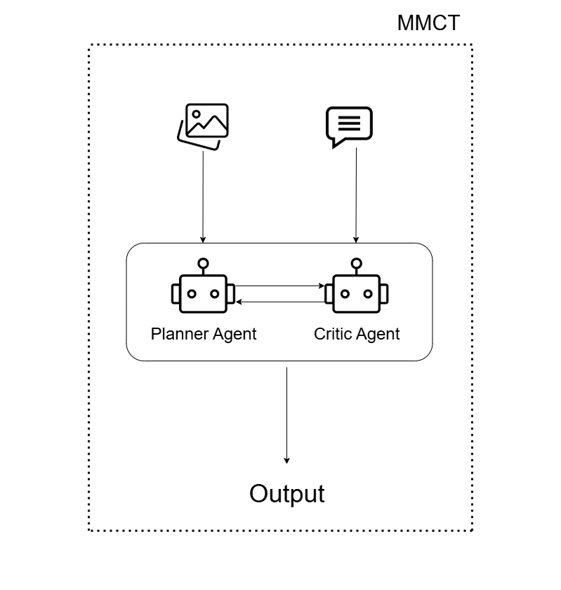
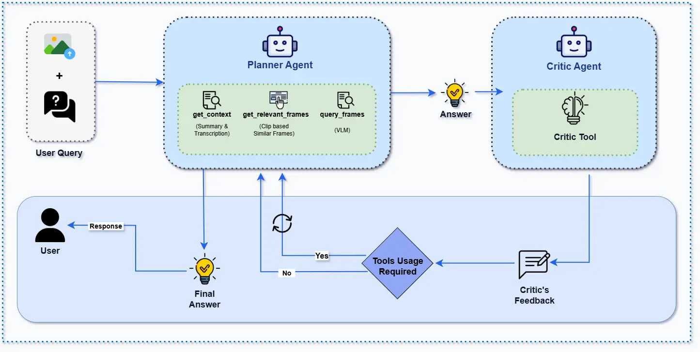

<div align="center">


</div>

# [**MMCT Agent**](https://arxiv.org/abs/2405.18358)
<p align='center'>
    <a href="docs/multimedia/videos/Demo_MMCT.mp4" style="text-decoration: None;">| Demo Video |</a>
</p>
<video width="100%" controls>
  <source src="docs/multimedia/videos/Demo_MMCT.mp4" type="video/mp4">
  Your browser does not support the video tag.
</video>


## **Overview**

This repository implements **MMCTAgent**, a novel **multi-modal critical thinking agent** designed to push the boundaries of visual reasoning and deep understanding across **images** and **videos**. Built upon our [research paper](https://arxiv.org/abs/2405.18358), MMCTAgent combines planning, self-critique, and tool-based reasoning to enhance decision-making in complex multi-modal tasks.

<p align="center">
  <a href="https://arxiv.org/abs/2405.18358">
    
  </a>
</p>

<p align="center">
  <a href="https://arxiv.org/abs/2405.18358">
    
    
  </a>
</p>

## **Key Features**

### Critical Thinking Architecture

MMCTAgent is inspired by human cognitive processes and integrates a structured reasoning loop:

- **Planner**:  
  Generates an initial response using relevant tools for visual or multi-modal inputs.

- **Critic** *(optional)*:  
  Evaluates the Planner’s response and provides feedback to improve accuracy and decision-making.  
  > The Critic is enabled by default. To disable, set `use_critic_agent=False`.

---

### Modular Agents

MMCTAgent includes two specialized agents:

#### ImageAgent

[](https://arxiv.org/abs/2405.18358)

A reasoning engine tailored for static image understanding.  
It supports a configurable set of tools via the `ImageQnaTools` enum:

- `OBJECT_DETECTION` – Detects objects in the image.
- `OCR` – Extracts embedded text content.
- `RECOG` – Recognizes scenes, faces, or objects.
- `VIT` – Applies GPT-4V for high-level visual reasoning.

> The Critic can be toggled via `use_critic_agent` flag.

---

#### VideoAgent
[](https://arxiv.org/abs/2405.18358)

Optimized for deep video understanding through a structured two-stage pipeline:

1. **Video Retrieval**  
   Uses an Azure AI Search index to fetch videos relevant to a user query.

2. **Video Question Answering**  

[](https://arxiv.org/abs/2405.18358)

   Applies a fixed toolchain orchestrated by the Planner:

   - `GET_VIDEO_DESCRIPTION` – Extracts transcript and visual summary.
   - `QUERY_VIDEO_DESCRIPTION` – Finds top-3 relevant timestamps.
   - `QUERY_FRAMES_COMPUTER_VISION` *(optional)* – Identifies visual cues.
   - `QUERY_VISION_LLM` – Combines frame-level visual and textual analysis.

> The Critic agent helps validate and refine answers, improving reasoning depth.

For more details, refer to the full research article:

**[MMCTAgent: Multi-modal Critical Thinking Agent
 Framework for Complex Visual Reasoning](https://arxiv.org/abs/2405.18358)**  
Published on **arXiv** – [arxiv.org/abs/2405.18358](https://arxiv.org/abs/2405.18358)

## **Citation**

If you find this repository helpful, please consider citing our paper:

```bibtex
@article{MMCT Agent,
  title={MMCTAgent: MMCTAgent is a novel multi-modal critical thinking agent framework designed to address the inherent limitations of current Multimodal LLMs in complex visual reasoning tasks. MMCTAgent iteratively analyzes multi-modal information, decomposes queries, plans strategies, and dynamically evolves its reasoning. Additionally, MMCTAgent incorporates critical thinking elements such as verification of final answers and self-reflection through a novel approach that defines a vision-based critic and identifies task-specific evaluation criteria, thereby enhancing its decision-making abilities.},
  author={Somnath Kumar, Yash Gadhia, Tanuja Ganu, Akshay Nambi},
  journal={arXiv preprint arXiv:2405.18358v1},
  year={2024}
}
```

---

## **Table of Contents**

- [Provider System](#provider-system)
- [Getting Started](#getting-started)
- [Installation](#installation)
- [Prerequisites](#prerequisites)
- [Configuration](#configuration)
- [Usage](#usage)
- [Project Structure](#project-structure)

---

## **Provider System**

### Multi-Cloud & Vendor-Agnostic Architecture

MMCTAgent now features a **modular provider system** that allows you to seamlessly switch between different cloud providers and AI services without changing your application code. This makes the framework truly **vendor-agnostic** and suitable for various deployment scenarios.

#### Supported Providers

| Service Type | Supported Providers | Use Cases |
|--------------|--------------------|-----------|
| **LLM** | Azure OpenAI, OpenAI | Text generation, chat completion |
| **Search** | Azure AI Search | Document search and retrieval |
| **Vision** | Azure Computer Vision, OpenAI Vision | Image analysis, object detection |
| **Transcription** | Azure Speech Services, OpenAI Whisper | Audio-to-text conversion |
| **Storage** | Azure Blob Storage, Local Storage | File storage and management |

#### Key Benefits

- **🔄 Vendor Independence**: Switch between Azure, OpenAI, and other providers
- **🛡️ Enhanced Security**: Built-in support for Managed Identity and Key Vault
- **⚙️ Flexible Configuration**: Environment-based or programmatic configuration
- **🔧 Easy Migration**: Backward compatibility with existing configurations
- **📊 Centralized Management**: Single configuration point for all services

#### Quick Provider Configuration

```bash
# Azure-first setup
LLM_PROVIDER=azure
SEARCH_PROVIDER=azure_ai_search
VISION_PROVIDER=azure

# OpenAI-first setup  
LLM_PROVIDER=openai
VISION_PROVIDER=openai
TRANSCRIPTION_PROVIDER=openai

# Hybrid setup
LLM_PROVIDER=azure
SEARCH_PROVIDER=elasticsearch
VISION_PROVIDER=openai
```

For detailed configuration instructions, see our [Provider Configuration Guide](docs/PROVIDERS.md).

---

## **Getting Started**

To get started with this repository:

1. **Clone the repository**

   ```sh
   git clone --branch <branch-name> <repository-url>
   cd <project-directory>
    ```

2. **FFMPEG Installation**
    - For Linux Environment:

    ```bash
    sudo apt-get update
    sudo apt-get install ffmpeg libsm6 libxext6  -y
    ```

    - For Windows:
        - Download FFmpeg from: <https://ffmpeg.org/download.html>
        - Choose the Windows build (e.g., from <https://www.gyan.dev/ffmpeg/builds/> )
        - Extract the files and add the bin folder to the system PATH variable so you can use ffmpeg from the command line.

    LibSM6 & libXext6 (Linux X11 Libraries): These libraries are mainly used for graphical applications on Linux and are not typically required on Windows.

3. **Install MiniConda [If Conda Environment is preferred]**

    You can refer to this [link](https://www.anaconda.com/docs/getting-started/miniconda/install)  for installation of Miniconda, according to your device configuration.

4. **Create the environment**

    You can use conda or venv.
    - **Installation Using Conda**

        ```bash
        conda create -n <env-name> python=3.11.11
        conda activate <env-name>
        ```

    - **Using venv (Python standard)**

        ```bash
        python -m venv <env-name>
        source <env-name>/bin/activate    # on Linux/Mac
        <env-name>\Scripts\activate.bat   # on Windows
        ```

5. **Install dependencies and set up the project**

    Ensure you have pip >= 21.3 to support pyproject.toml installations.

    ```bash
    pip install --upgrade pip
    pip install -r requirements.txt
    ```

## **Prerequisites**

Below are the Azure Resources that are required to execute this repository. You can checkout the `infra` folder and utilize the `INFRA_DEPLOYMENT_GUIDE` to not only deploy the resources through ARM Templates but also build the containers and directly deploy the script to Azure App Services and Azure Container Apps.

| Resource Name                 | Documentation Article | Microsoft Intra-Identity Role |
|--------------------------------|----------------------|------------------------------------|
| Storage Account                | [Document](https://learn.microsoft.com/en-us/azure/storage/common/storage-account-overview)        | *Storage Blob Data Reader/Contributor* |
| Azure Computer Vision  [Optional]        | [Document](https://learn.microsoft.com/en-us/azure/ai-services/computer-vision/)        | *Cognitive Services User*           |
| Azure OpenAI (4o, 4o-mini, text-embedding-ada-002, Whisper) | [Document](https://learn.microsoft.com/en-us/azure/ai-services/openai/) | *Cognitive Services OpenAI User* |
| Azure AI Search                | [Document](https://learn.microsoft.com/en-us/azure/search/)        | *Search Index Data Contributor*       |
| Azure AI Search                | [Document](https://learn.microsoft.com/en-us/azure/search/)        | *Search Service Contributor*       |
| Azure Speech Service           | [Document](https://learn.microsoft.com/en-us/azure/ai-services/speech-service/)        | *Cognitive Services Speech Contributor* or *Cognitive Services Speech User* role.          |
| Azure App Service [Optional] | [Document](https://learn.microsoft.com/en-us/azure/app-service/)        | *NA*             |
| Azure Event Hub [Optional] | [Document](https://learn.microsoft.com/en-us/azure/app-service/)        | *Azure Event Hubs Data Owner* |
| Azure Container Registry [Optional] | [Document](https://learn.microsoft.com/en-us/azure/container-registry/) | *Reader or Contributor* |
| Application Insights [Optional]          | [Document](https://learn.microsoft.com/en-us/azure/azure-monitor/app/app-insights-overview)        | *NA*                                |

> Note: If you want to utilize the Microsoft Azure Intra Id Access then you can assign the above corresponding roles for the each resource. Otherwise you can use the API Key or Connection String approach to utilize the resources.

## **Configuration**

### Environment Setup

MMCTAgent uses a flexible configuration system that supports multiple cloud providers. Choose your configuration method:

#### Quick Start - Copy Environment Template

```bash
# For development
cp config/environments/development.env .env

# For production
cp config/environments/production.env .env
```

Then edit `.env` with your specific values.

#### Provider Configuration Examples

**Azure-First Setup:**
```bash
# LLM Configuration
LLM_PROVIDER=azure
LLM_ENDPOINT=https://your-resource.openai.azure.com/
LLM_DEPLOYMENT_NAME=gpt-4o
LLM_MODEL_NAME=gpt-4o
LLM_USE_MANAGED_IDENTITY=true

# Search Configuration
SEARCH_PROVIDER=azure_ai_search
SEARCH_ENDPOINT=https://your-search.search.windows.net
SEARCH_USE_MANAGED_IDENTITY=true
SEARCH_INDEX_NAME=your-index-name

# Storage Configuration
STORAGE_PROVIDER=azure_blob
STORAGE_ACCOUNT_NAME=your-storage-account
STORAGE_USE_MANAGED_IDENTITY=true
```

**OpenAI Setup:**
```bash
# LLM Configuration
LLM_PROVIDER=openai
LLM_ENDPOINT=https://api.openai.com
LLM_MODEL_NAME=gpt-4o
OPENAI_API_KEY=your-openai-api-key

# Vision Configuration
VISION_PROVIDER=openai
OPENAI_VISION_MODEL=gpt-4o

# Transcription Configuration
TRANSCRIPTION_PROVIDER=openai
OPENAI_WHISPER_MODEL=whisper-1
```

**Hybrid Setup:**
```bash
# Use Azure for LLM
LLM_PROVIDER=azure
LLM_ENDPOINT=https://your-resource.openai.azure.com/

# Use OpenAI for vision
VISION_PROVIDER=openai
OPENAI_API_KEY=your-openai-key

# Use Elasticsearch for search
SEARCH_PROVIDER=elasticsearch
ELASTICSEARCH_ENDPOINT=https://your-elasticsearch.com
```

### Security Configuration

#### Managed Identity (Recommended for Azure)
```bash
LLM_USE_MANAGED_IDENTITY=true
SEARCH_USE_MANAGED_IDENTITY=true
STORAGE_USE_MANAGED_IDENTITY=true
```

#### Azure Key Vault (Production)
```bash
ENABLE_SECRETS_MANAGER=true
KEYVAULT_URL=https://your-keyvault.vault.azure.net/
```

### Logging Configuration
```bash
LOG_LEVEL=INFO
LOG_ENABLE_FILE=true
LOG_ENABLE_JSON=false
LOG_MAX_FILE_SIZE=10 MB
```

📖 **For comprehensive configuration options, see our [Provider Configuration Guide](docs/PROVIDERS.md)**

## **Usage**

You can refer to the `examples` directory to understand the usage of this repository. Below are the sample scripts you can refer to get started:

> MMCT Image Agent

```python
from mmct.image_pipeline import ImageAgent, ImageQnaTools
import asyncio
import ast

# user query
query = "" 
# define the tools, you can refer to the Enum definition of Tools to get the idea for available tools
tools = [ImageQnaTools.OBJECT_DETECTION, ImageQnaTools.VIT]
# flag variable whether you want to initialize Critic Agent or not.
use_critic_agent = True
# flag variable whether you have to stream or not.
stream = False
# initialize the Image Agent.
mmct_agent = ImageAgent(
    query=query,
    image_path=image_path,
    tools=tools,
    use_critic_agent=use_critic_agent,
    stream=stream,
)

response = asyncio.run(mmct_agent())
print(response.response)
```

> MMCT Video Agent

```python
import asyncio
import ast
from mmct.video_pipeline import VideoAgent

query = ""
index_name = ""  # Azure AI Search index name
top_n = 3  # Number of top results (video ids for MMCT VQnA) to return from the index
use_computer_vision_tool = False   # flag for selection of Azure Computer Vision Tool
use_critic_agent = True     # flag to utilize Critic Agent.
stream = True               # flag to stream the logs of the Agentic Flow.

video_agent = VideoAgent(
    query=query,
    index_name=index_name,
    top_n=top_n,
    use_computer_vision_tool=use_computer_vision_tool,
    use_critic_agent=use_critic_agent,
    stream=stream,
)

response = asyncio.run(video_agent())
print(response)
```

## **Project Structure**

Below is the project structure highlighting the key entry-point scripts for running the three main pipelines— `Image QNA`, `Video Ingestion` and `Video Agent`.

```sh
MMCTAgent
| 
├── infra
|   └── INFRA_DEPLOYMENT_GUIDE.md    # Guide for deployment of Azure Infrastructure 
├── app                              # contains the FASTAPI application over the mmct pipelines.
├── mmct
│   ├── .
│   ├── image_pipeline
│   │   ├── agents
│   │   │    └── image_agent.py      #  Entry point for the MMCT Image Agentic Workflow
│   │   └── README.md                #  Guide for Image Pipeline
│   └── video_pipeline
│       ├── agents
│       │   └── video_agent.py      # Entry point for the MMCT Video Agentic Workflow
│       ├── core
│       │     └── ingestion
│       │           └── ingestion_pipeline.py   # Entry point for the Video Ingestion Workflow
│       └── README.md                # Guide for Video Pipeline  
├── requirements.txt
└──README.md  
```
