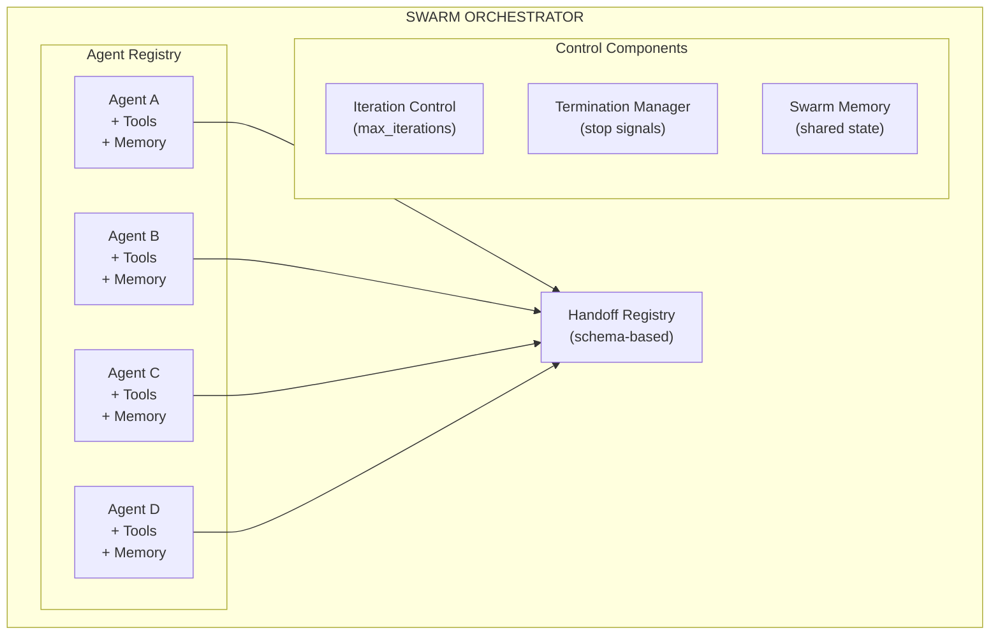
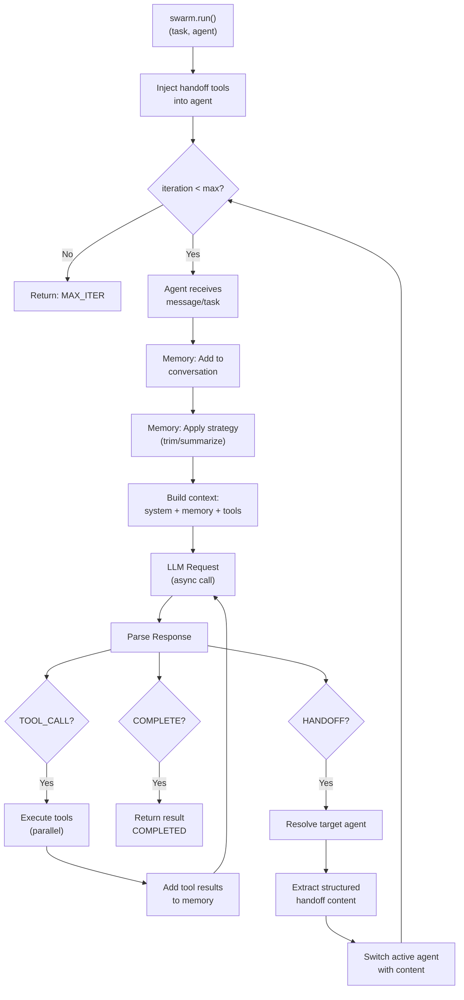
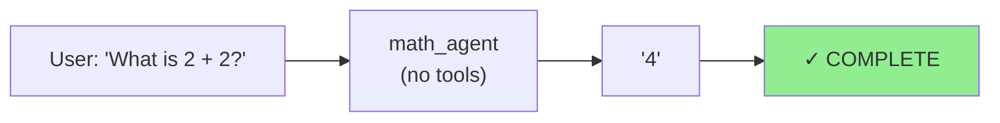
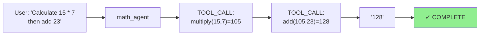
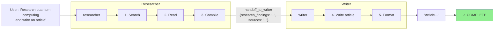
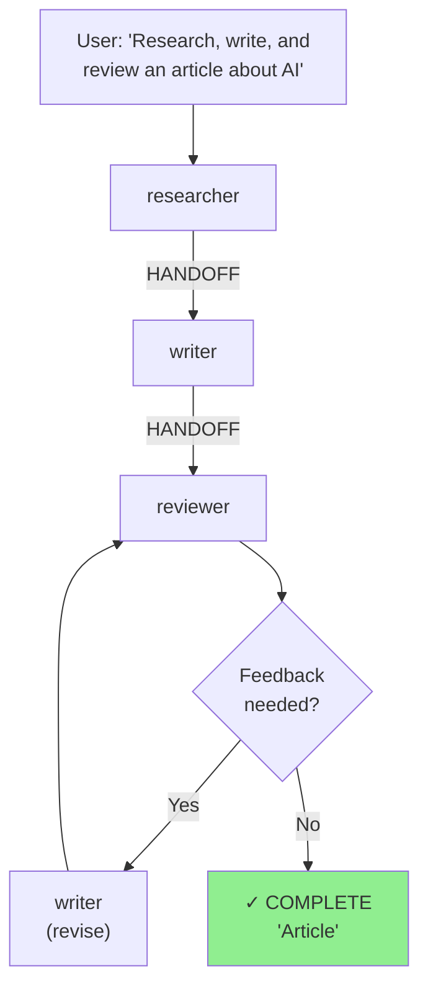
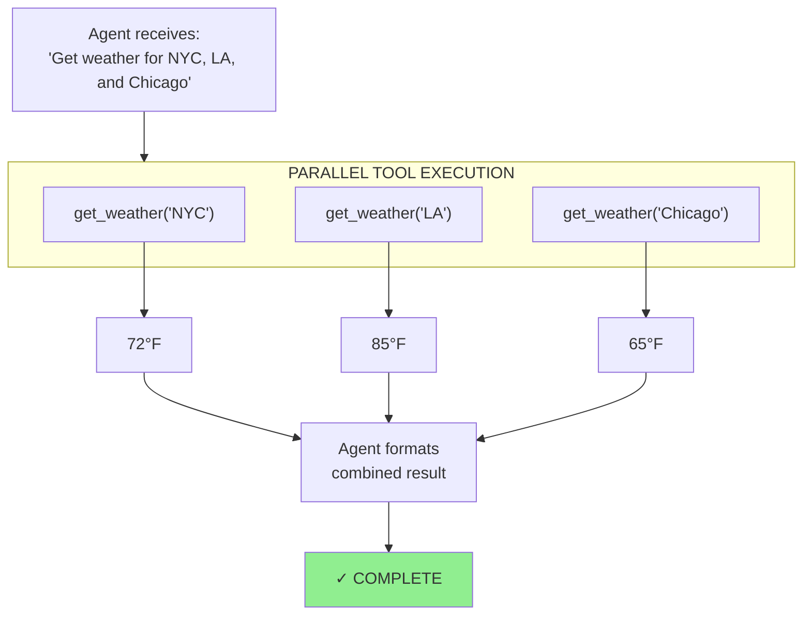
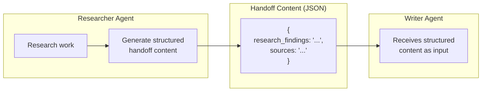

# MMCT Agent Framework

A blazingly fast, async-first Python agentic framework with swarm collaboration capabilities.

## Features

- 🚀 **Async-first design** - Built for speed, only limited by LLM/tool execution latency
- 🤖 **Multi-agent support** - Create and manage multiple LLM-based agents
- 🔧 **Tool integration** - Attach sync/async Python functions as tools with parallel execution
- 🐝 **Swarm collaboration** - Agents can hand off tasks with context transformation
- 🧠 **Smart memory management** - Dynamic strategies to prevent context explosion
- 🔌 **Provider agnostic** - Azure OpenAI support with easy extensibility
- 📊 **Full observability** - Structured logging, hooks, latency and token tracking
- 💾 **Persistence** - Save session memory to disk for debugging

## Installation

```bash
pip install mmct-agent-framework
```

Or install from source:

```bash
pip install -e .
```

## Quick Start

```python
import asyncio
from azure.identity import DefaultAzureCredential
from mmct_agent import Agent, tool
from mmct_agent.llm import AzureOpenAIClient
from mmct_agent.config import Settings

# Define tools using the @tool decorator
@tool(description="Add two numbers together")
async def add(a: int, b: int) -> int:
    return a + b

@tool(description="Multiply two numbers")
def multiply(a: int, b: int) -> int:
    return a * b

async def main():
    # Load settings from environment
    settings = Settings()
    
    # Create LLM client with Azure credential
    llm_client = AzureOpenAIClient(
        endpoint=settings.azure_openai_endpoint,
        deployment=settings.azure_openai_deployment,
        api_version=settings.azure_openai_api_version,
        azure_credential=DefaultAzureCredential(),
    )

    # Create agent with tools
    agent = Agent(
        name="math_assistant",
        system_prompt="You are a helpful math assistant. Use tools to perform calculations.",
        llm_client=llm_client,
        tools=[add, multiply],
    )

    # Run the agent
    response = await agent.run("What is 15 + 27, then multiply the result by 3?")
    print(response.content)
    print(f"Token usage: {response.token_usage.total_tokens} tokens")

asyncio.run(main())
```

## Multi-Agent Swarm Example

```python
import asyncio
from azure.identity import DefaultAzureCredential
from mmct_agent import Agent, Swarm, tool
from mmct_agent.llm import AzureOpenAIClient
from mmct_agent.config import Settings
from mmct_agent.core.swarm import SwarmConfig

# Define tools for agents
@tool(description="Search the web for information on a topic")
async def search_web(query: str) -> dict:
    return {"query": query, "results": [...]}

@tool(description="Generate an outline for a topic")
async def generate_outline(topic: str, sections: int = 5) -> list:
    return [f"Section {i}" for i in range(sections)]

@tool(description="Check grammar and style of text")
def check_grammar(text: str) -> dict:
    return {"issues_found": 0, "suggestions": []}

async def main():
    settings = Settings()
    llm_client = AzureOpenAIClient(
        endpoint=settings.azure_openai_endpoint,
        deployment=settings.azure_openai_deployment,
        api_version=settings.azure_openai_api_version,
        azure_credential=DefaultAzureCredential(),
    )

    # Create specialized agents
    researcher = Agent(
        name="researcher",
        system_prompt="You research topics and gather information.",
        llm_client=llm_client,
        tools=[search_web],
    )

    writer = Agent(
        name="writer",
        system_prompt="You write polished content based on research.",
        llm_client=llm_client,
        tools=[generate_outline],
    )

    editor = Agent(
        name="editor",
        system_prompt="You review and polish the final content.",
        llm_client=llm_client,
        tools=[check_grammar],
    )

    # Register handoffs with content schemas
    researcher.register_handoff(
        target="writer",
        description="Hand off to writer when research is complete",
        content_schema={
            "type": "object",
            "properties": {
                "research_findings": {
                    "type": "string",
                    "description": "Comprehensive research findings and key insights.",
                },
                "sources": {
                    "type": "string",
                    "description": "List of sources consulted.",
                },
            },
            "required": ["research_findings"],
        },
    )

    writer.register_handoff(
        target="editor",
        description="Hand off to editor when draft is complete",
        content_schema={
            "type": "object",
            "properties": {
                "draft": {
                    "type": "string",
                    "description": "The complete article draft.",
                },
                "notes": {
                    "type": "string",
                    "description": "Any notes for the editor.",
                },
            },
            "required": ["draft"],
        },
    )

    # Create swarm with configuration
    swarm = Swarm(
        agents=[researcher, writer, editor],
        config=SwarmConfig(max_iterations=10),
    )

    # Run swarm
    result = await swarm.run(
        initial_agent="researcher",
        task="Research and write an article about quantum computing.",
    )

    print(result.final_response.content)
    print(f"Agents used: {' → '.join(result.agents_used)}")
    print(f"Total tokens: {result.total_token_usage.total_tokens}")

asyncio.run(main())
```

## Configuration

Set environment variables or use a `.env` file:

```bash
# Required
AZURE_OPENAI_ENDPOINT=https://your-resource.openai.azure.com/
AZURE_OPENAI_DEPLOYMENT=gpt-4

# Optional
AZURE_OPENAI_API_VERSION=2024-02-15-preview  # defaults to 2024-02-15-preview
```

### Authentication

The framework uses Azure Identity for authentication. Use `DefaultAzureCredential` which automatically tries multiple auth methods:

```python
from azure.identity import DefaultAzureCredential

llm_client = AzureOpenAIClient(
    endpoint=settings.azure_openai_endpoint,
    deployment=settings.azure_openai_deployment,
    azure_credential=DefaultAzureCredential(),
)
```

Supported credential types include:
- Environment credentials (`AZURE_CLIENT_ID`, `AZURE_CLIENT_SECRET`, `AZURE_TENANT_ID`)
- Managed Identity (when running in Azure)
- Azure CLI credentials (`az login`)
- Visual Studio Code credentials

## Agent Configuration

Agents accept optional keyword arguments for fine-tuning behavior:

```python
agent = Agent(
    name="my_agent",
    system_prompt="You are a helpful assistant.",
    llm_client=llm_client,
    tools=[my_tool],
    # Optional configuration (keyword-only arguments)
    max_tool_iterations=10,      # Max tool execution loops (default: 10)
    parallel_tool_calls=True,    # Execute tools in parallel (default: True)
    tool_timeout_seconds=30.0,   # Timeout per tool call (default: 30.0)
    stream_responses=False,      # Stream LLM responses (default: False)
)
```

| Parameter | Type | Default | Description |
|-----------|------|---------|-------------|
| `max_tool_iterations` | `int` | `10` | Maximum number of tool execution iterations before stopping |
| `parallel_tool_calls` | `bool` | `True` | Execute multiple tool calls in parallel for speed |
| `tool_timeout_seconds` | `float` | `30.0` | Timeout for individual tool execution |
| `stream_responses` | `bool` | `False` | Stream LLM responses chunk by chunk |

## Memory Management

The framework provides flexible memory management with multiple strategies and explicit persistence for debugging.

### Memory Strategies

| Strategy | Description | Use Case |
|----------|-------------|----------|
| `SlidingWindowMemory` | Keeps the last N messages | Simple, predictable memory limit |
| `TokenBasedMemory` | Keeps messages under a token limit | Context-aware, respects model limits |
| `SummarizationMemory` | Summarizes older messages when threshold exceeded | Preserves context while reducing tokens |
| `AdaptiveMemory` | Dynamically adjusts strategy based on conversation | Optimizes memory usage automatically |

### Using Memory Strategies

```python
from mmct_agent.memory import (
    SlidingWindowMemory,
    TokenBasedMemory,
    SummarizationMemory,
    AdaptiveMemory,
)

# Keep last N messages
agent = Agent(..., memory=SlidingWindowMemory(window_size=20))

# Keep under token limit with buffer
agent = Agent(..., memory=TokenBasedMemory(max_tokens=4000, token_buffer=500))

# Summarize older messages when exceeding threshold
agent = Agent(..., memory=SummarizationMemory(
    llm_client=llm_client,
    summarization_threshold=1500,
    summary_max_tokens=300,
))

# Adaptive: automatically selects best strategy based on context
agent = Agent(..., memory=AdaptiveMemory(
    llm_client=llm_client,
    max_tokens=2000,
    window_size=10,
    summarization_threshold=1500,
))
```

### Memory Persistence (Debugging)

Memory is **not** automatically saved to disk. You must explicitly call `save_memory()` when needed:

```python
# Run agent
result = await agent.run("What is the capital of France?")

# Explicitly save memory for debugging
saved_path = await agent.save_memory(
    path="./debug/agent_memory",
    session_id="my_session",
)
print(f"Memory saved to: {saved_path}")

# For swarm orchestration
swarm_result = await swarm.run(initial_agent="researcher", task="...")
await swarm.save_memory("./debug/swarm_memory/")  # Saves all agent memories
```

This design keeps runtime fast and gives you full control over when I/O occurs.

## Swarm Orchestration

Swarm orchestration enables multiple agents to collaborate on complex tasks through explicit message passing and handoffs.

### Architecture Overview



### Complete Agentic Flow

The following diagram shows the complete decision tree for how a swarm processes a task:



### Termination Conditions

The swarm terminates when any of these conditions are met:

| Condition | Trigger | Result |
|-----------|---------|--------|
| **Completion** | Agent responds without handoff or tool call | `termination_reason="completed"` |
| **Max Iterations** | `iteration >= max_iterations` | `termination_reason="max_iterations"` |
| **Explicit Signal** | Agent outputs `TASK_COMPLETE` | `termination_reason="completed"` |
| **Error** | Unrecoverable exception | `termination_reason="error"` |
| **No Valid Handoff** | Agent requests handoff to unknown agent | `termination_reason="error"` |

### Flow Scenarios

#### Scenario 1: Simple Single-Agent Task


**Iterations: 1**

#### Scenario 2: Agent with Tool Calls


**Iterations: 1** (tool loops don't count as iterations)

#### Scenario 3: Multi-Agent Handoff


**Iterations: 2** (researcher=1, writer=1)

#### Scenario 4: Complex Multi-Agent Pipeline with Review Loop


**Iterations: 3-5** (depends on review cycles)

#### Scenario 5: Parallel Tool Execution


**Time: ~1 tool call latency (parallel), not 3x**

### Agent Awareness of Other Agents

Agents learn about handoff targets through tool registration. When you call `register_handoff()`, a tool is created based on the content schema:

```python
# This registration:
researcher.register_handoff(
    target="writer",
    description="Hand off to writer when research is complete",
    content_schema={
        "type": "object",
        "properties": {
            "research_findings": {"type": "string", "description": "..."},
            "sources": {"type": "string", "description": "..."},
        },
        "required": ["research_findings"],
    },
)

# Creates a tool named "handoff_to_writer" that the LLM can call
# with the specified schema parameters
```

Only registered handoff targets are visible to each agent:
```python
researcher.register_handoff(target="writer", ...)   # researcher sees: handoff_to_writer
writer.register_handoff(target="editor", ...)       # writer sees: handoff_to_editor
# researcher does NOT see handoff_to_editor (no direct path)
```

### Memory During Handoffs

With schema-based handoffs, the source agent generates structured content that is passed directly to the target agent:



The handoff content schema ensures:
- Source agent provides exactly the data the target needs
- No information is lost or summarized incorrectly
- Target agent can rely on structured, predictable input

### SwarmResult Structure

```python
@dataclass
class SwarmResult:
    """Result of a swarm execution."""
    
    final_response: AgentResponse | None  # Last agent's response
    agent_responses: list[AgentResponse]  # All agent responses
    total_token_usage: TokenUsage         # Tokens used across all agents
    total_latency_ms: float               # Wall-clock time
    iterations: int                       # Number of agent turns
    agents_used: list[str]                # ["researcher", "writer", "editor"]
    trace_id: str                         # Trace ID for debugging
    success: bool                         # Whether swarm completed successfully
    error: str | None                     # Error message if failed
    
# Example:
result = await swarm.run(initial_agent="researcher", task="...")
print(result.success)                           # True
print(result.agents_used)                       # ["researcher", "writer", "editor"]
print(result.iterations)                        # 3
print(result.total_token_usage.total_tokens)    # 5432
print(result.final_response.content)            # "The final article..."
```

### Configuring Handoffs

Handoffs use a JSON schema to define structured content the agent must provide:

```python
from mmct_agent.core import Agent, Swarm

# Create agents
researcher = Agent(name="researcher", ...)
writer = Agent(name="writer", ...)

# Register handoff with content schema
researcher.register_handoff(
    target="writer",
    description="Hand off to writer when research is complete",
    content_schema={
        "type": "object",
        "properties": {
            "research_findings": {
                "type": "string",
                "description": "Comprehensive research findings and key insights.",
            },
            "sources": {
                "type": "string",
                "description": "List of sources consulted.",
            },
        },
        "required": ["research_findings"],
    },
)

# Create swarm
swarm = Swarm(agents=[researcher, writer])

# Run the swarm
result = await swarm.run(
    initial_agent="researcher",
    task="Research and write about AI trends.",
)

# Access results
print(result.final_response)
print(result.agents_used)  # Track which agents were invoked
```

### Swarm Memory Management

Each agent in a swarm maintains its own memory. The swarm provides methods to inspect and persist all agent memories:

```python
# Save all agent memories to a directory
await swarm.save_memory("./debug/swarm_session/")
# Creates:
#   ./debug/swarm_session/researcher_memory.json
#   ./debug/swarm_session/writer_memory.json

# Access individual agent memory
researcher_messages = await swarm.agents["researcher"].memory.get_messages()
```

### Handoff Content Schema

The `content_schema` parameter in `register_handoff` defines what structured data the agent must provide when handing off. This ensures the target agent receives exactly the information it needs:

```python
# Writer hands off the complete draft to editor
writer.register_handoff(
    target="editor",
    description="Hand off the draft for editing",
    content_schema={
        "type": "object",
        "properties": {
            "draft": {
                "type": "string",
                "description": "The complete article draft.",
            },
            "notes": {
                "type": "string",
                "description": "Areas that need special attention.",
            },
        },
        "required": ["draft"],
    },
)
```

The schema is converted to a tool definition, so the LLM generates the structured content automatically.

