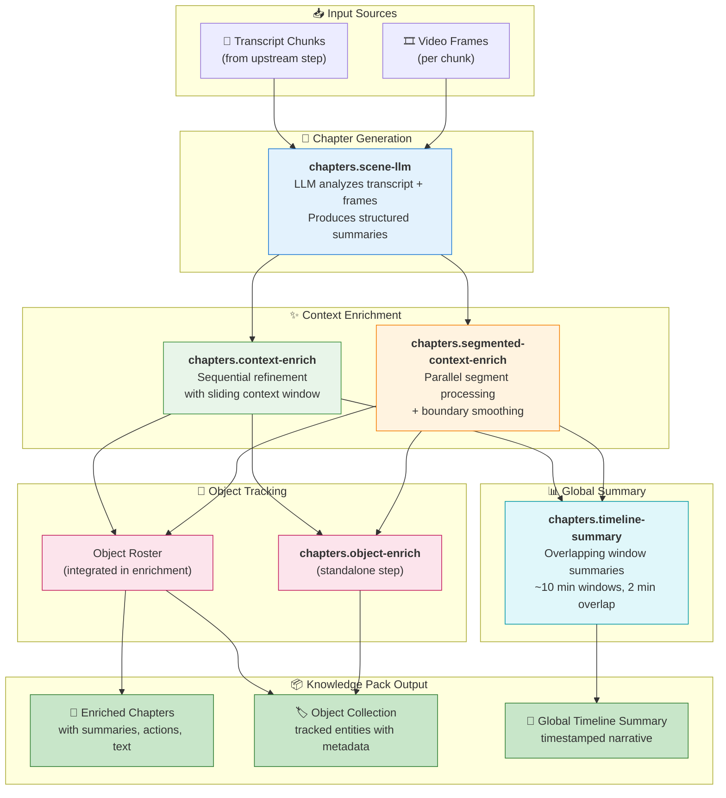
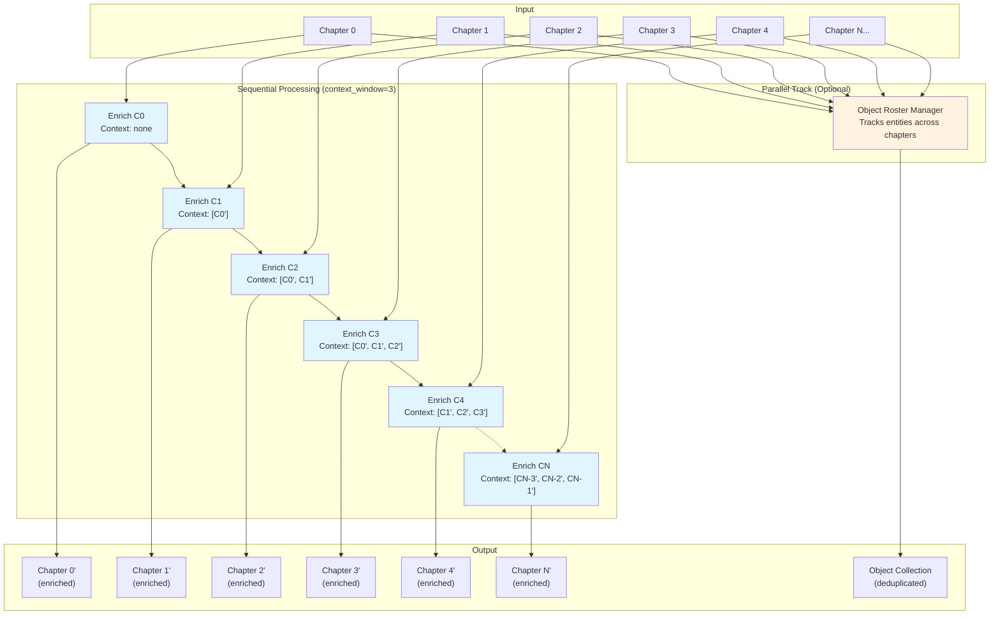
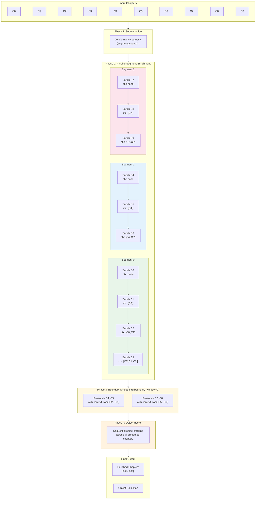
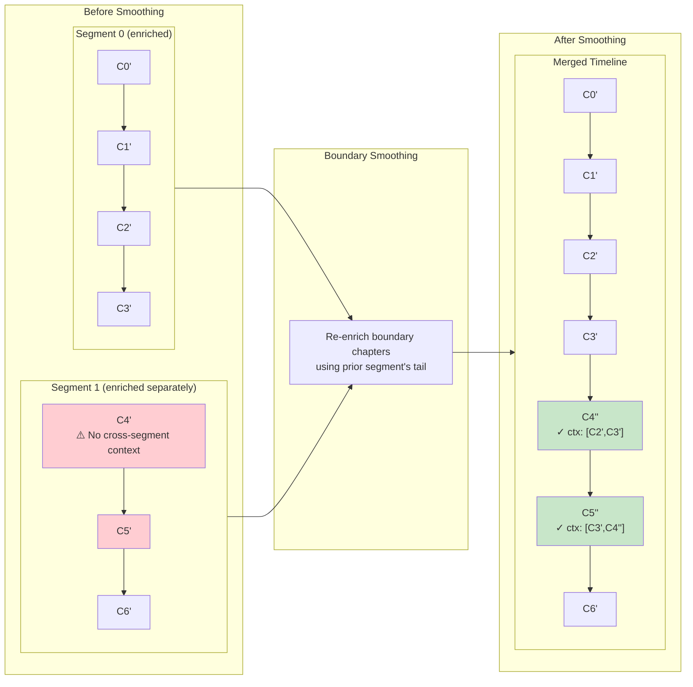

# Chapter Generation Pipeline

This module provides a comprehensive pipeline for generating and enriching semantic chapters from video transcripts and frames. The system transforms raw video content into structured, queryable knowledge with rich metadata about objects, actions, and narrative context.

## Table of Contents
- [Overview](#overview)
- [Pipeline Architecture](#pipeline-architecture)
- [Processing Steps](#processing-steps)
  - [1. Scene-LLM Chapter Generation](#1-scene-llm-chapter-generation-chaptersscene-llm)
  - [2. Context Enrichment](#2-context-enrichment-chapterscontext-enrich)
  - [3. Segmented Context Enrichment](#3-segmented-context-enrichment-chapterssegmented-context-enrich)
  - [4. Object Enrichment](#4-object-enrichment-chaptersobject-enrich)
  - [5. Timeline Summary](#5-timeline-summary-chapterstimeline-summary)
- [Data Models](#data-models)
- [Configuration](#configuration)
- [Output Structure](#output-structure)

---

## Overview

The chapter generation system processes video content through multiple stages:

1. **Chunking**: Video transcripts are segmented into temporal chunks (handled by upstream steps)
2. **Frame Extraction**: Key frames are extracted and aligned with transcript chunks (handled by upstream steps)
3. **Chapter Generation**: LLM analyzes transcript + frames to produce structured summaries
4. **Context Enrichment**: Chapters are refined using prior context for narrative continuity
5. **Object Tracking**: Entities (people, objects, text) are tracked across chapters
6. **Global Summarization**: Overlapping window summaries create a queryable timeline

---

## Pipeline Architecture



**Pipeline Flow Summary**:
1. **Inputs**: Transcript chunks and extracted video frames from upstream pipeline steps
2. **Generation**: LLM-based chapter creation using `scene-llm` with transcript + frame analysis
3. **Enrichment**: Refine chapters with context - sequential for shorter videos, segmented for parallelism
4. **Object Tracking**: Either integrated during enrichment or as a standalone post-processing step
5. **Summary**: Generate overlapping timestamped global summaries for the entire video
6. **Output**: Complete knowledge pack with chapters, objects, and timeline summary

---

## Processing Steps

### 1. Scene-LLM Chapter Generation (`chapters.scene-llm`)

**Purpose**: Primary chapter generation using LLM analysis of transcript + video frames.

**How it works**:
1. **Work Item Preparation**: Aligns transcript chunks with their corresponding extracted frames
2. **Batch Processing**: Processes chunks in configurable batches with parallel execution
3. **LLM Analysis**: For each chunk, sends:
   - Base64-encoded frames (up to `max_frames_per_chapter`)
   - Transcript text with timestamp metadata
   - Frame timeline mapping
4. **Response Parsing**: Validates and structures LLM output into `ChapterCreationResponse`

**LLM Prompt Strategy**:
- System prompt: "VideoAnalyzerGPT" persona for exhaustive analysis
- Includes all visible frames with timestamps
- Requests structured JSON output with:
  - Detailed summary (integrating visual + transcript)
  - Actions performed in the scene
  - Visible text extraction
  - Object tracking (people, items, text, background elements)

**Parameters**:
| Parameter | Type | Default | Description |
|-----------|------|---------|-------------|
| `chunks_step` | string | required | Step containing transcript chunks |
| `frames_step` | string | required | Step containing extracted frames |
| `max_frames_per_chapter` | int | 12 | Max frames sent to LLM per chapter |
| `batch_size` | int | 5 | Chapters processed per batch |
| `max_parallel_requests` | int | batch_size | Concurrent LLM requests |
| `llm_request_options` | dict | {} | Additional LLM parameters |
| `collect_object_collection` | bool | true | Whether to track objects |

**Output**:
```json
{
  "chapters": [
    {
      "chunk_index": 0,
      "start": 0.0,
      "end": 120.5,
      "duration": 120.5,
      "transcript": "Full transcript text...",
      "transcript_segments": [...],
      "frame_paths": ["/path/to/frame1.jpg", ...],
      "chapter": {
        "detailed_summary": "Comprehensive summary...",
        "action_taken": "Demonstrates cutting technique...",
        "text_from_scene": "Recipe title visible...",
        "object_collection": [...]
      }
    }
  ]
}
```

---

### 2. Context Enrichment (`chapters.context-enrich`)

**Purpose**: Refines chapters using a sliding window of prior chapter context for narrative continuity.

**How it works**:
1. **Sequential Processing**: Processes chapters in order, maintaining history
2. **Context Window**: Uses last N chapters as context for current enrichment
3. **LLM Refinement**: "SeniorNarrativeAnalystGPT" persona refines summaries:
   - Incorporates prior chapter summaries and actions
   - Maintains factual grounding from transcript
   - Highlights narrative continuity and transitions
4. **Parallel Object Roster**: Optionally runs object tracking in parallel

#### Sequential Context Enrichment Flow



**Key Characteristics**:
- Strictly sequential: Each chapter waits for prior enrichments
- Growing context: Early chapters have less context than later ones
- Total LLM calls: N (one per chapter) + object roster calls

**Object Roster Integration**:
When `object_enrichment.enabled` is true:
- Runs alongside chapter enrichment
- Uses `ObjectRosterManager` to deduplicate and track objects
- Applies add/update/remove operations across chapters
- Filters objects by minimum screen time and chunk occurrences

**Parameters**:
| Parameter | Type | Default | Description |
|-----------|------|---------|-------------|
| `chapters_step` | string | required | Step containing initial chapters |
| `context_window` | int | 3 | Number of prior chapters for context |
| `llm_request_options` | dict | {} | Additional LLM parameters |
| `object_enrichment.enabled` | bool | true | Enable object roster tracking |
| `object_enrichment.max_active_context` | int | 12 | Max active objects in context |
| `object_enrichment.min_screen_time_seconds` | float | 8.0 | Min screen time to include |
| `object_enrichment.min_chunk_occurrences` | int | 2 | Min chapters for inclusion |

**Output**:
```json
{
  "chapters": [
    {
      "chunk_index": 0,
      "chapter": { /* enriched ChapterCreationResponse */ },
      "original_chapter": { /* pre-enrichment data */ }
    }
  ],
  "object_collection": [...],
  "object_operations": [...],
  "object_stats": {...}
}
```

---

### 3. Segmented Context Enrichment (`chapters.segmented-context-enrich`)

**Purpose**: Parallelized enrichment for long videos by splitting into segments.

**How it works**:
1. **Segmentation**: Divides chapters into N equal segments
2. **Parallel Enrichment**: Each segment enriches independently and in parallel
3. **Boundary Smoothing**: Re-enriches boundary chapters using cross-segment context
4. **Object Roster**: Runs after smoothing to ensure consistent tracking

#### Segmented Context Enrichment Flow



#### Detailed Boundary Smoothing



**Key Characteristics**:
- **Parallelism**: Segments enrich simultaneously (speed = video_length / segment_count)
- **Boundary Fix**: Smoothing ensures narrative continuity at segment junctions
- **Trade-off**: More segments = faster but more boundary re-enrichment
- **LLM Calls**: N + (boundary_window × (segment_count - 1)) + object roster calls

**Parameters**:
| Parameter | Type | Default | Description |
|-----------|------|---------|-------------|
| `chapters_step` | string | required | Step containing initial chapters |
| `context_window` | int | 3 | Prior chapters for context |
| `segment_count` | int | 5 | Number of parallel segments |
| `boundary_window` | int | context_window | Chapters to smooth at boundaries |
| `llm_request_options` | dict | {} | Additional LLM parameters |
| `object_enrichment.*` | - | - | Same as context-enrich |

---

### 4. Object Enrichment (`chapters.object-enrich`)

**Purpose**: Standalone object roster consolidation across chapters.

**How it works**:
1. **Object Collection**: Gathers per-chapter object collections
2. **Delta Operations**: LLM ("VideoObjectTrackerGPT") generates add/update/remove commands
3. **Roster Maintenance**: Applies operations to active and global object sets
4. **Filtering**: Removes objects below screen time/occurrence thresholds

**ObjectRosterManager Algorithm**:
```
For each chapter:
  1. Serialize active objects (limited to max_active_context)
  2. Extract chapter's local objects
  3. LLM generates ObjectEnrichmentResponse with operations:
     - ADD: New object introduced
     - UPDATE: Existing object gets new attributes
     - REMOVE: Object leaves the scene
  4. Apply operations to active roster
  5. Track presence stats (chunks, duration)

Finalization:
  - Filter by min_screen_time_seconds
  - Filter by min_chunk_occurrences
  - Sort by first_seen timestamp
```

**Parameters**:
| Parameter | Type | Default | Description |
|-----------|------|---------|-------------|
| `chapters_step` | string | required | Step with chapters containing objects |
| `max_active_context` | int | 12 | Max objects in active context |
| `min_screen_time_seconds` | float | 8.0 | Min total duration for inclusion |
| `min_chunk_occurrences` | int | 2 | Min chapters for inclusion |
| `llm_request_options` | dict | {} | Additional LLM parameters |

---

### 5. Timeline Summary (`chapters.timeline-summary`)

**Purpose**: Creates overlapping timestamped global summaries for the entire video.

**How it works**:
1. **Window Creation**: Splits timeline into overlapping windows (default ~10 min, 2 min overlap)
2. **Per-Window Summarization**: LLM summarizes each window's chapters
3. **Token Budget Enforcement**: Trims summaries to fit target budget
4. **Labeled Output**: Generates timestamped narrative sections

**Output Format**:
```
00:00:00,000 - 00:10:00,000: The video opens with an introduction to...
00:08:00,000 - 00:18:00,000: Transitioning from setup, the presenter...
00:16:00,000 - 00:26:00,000: The core demonstration begins with...
```

**Parameters**:
| Parameter | Type | Default | Description |
|-----------|------|---------|-------------|
| `chapters_step` | string | required | Step containing enriched chapters |
| `window_minutes` | float | 10.0 | Window duration in minutes |
| `window_overlap_minutes` | float | 2.0 | Overlap between windows |
| `target_token_budget` | int | 4000 | Max tokens for global summary |
| `llm_request_options` | dict | {} | Additional LLM parameters |

**Output**:
```json
{
  "global_summary": "00:00:00,000 - 00:10:00,000: ...\n\n00:08:00,000 - ...",
  "global_summary_sections": ["00:00:00,000 - 00:10:00,000: ...", ...],
  "windows": [
    {
      "window_index": 0,
      "start": 0.0,
      "end": 600.0,
      "duration": 600.0,
      "chapter_count": 5,
      "summary": "The video opens with...",
      "labeled_summary": "00:00:00,000 - 00:10:00,000: The video opens with..."
    }
  ]
}
```

---

## Data Models

### ChapterCreationResponse

Core output structure for generated chapters:

```python
class ChapterCreationResponse(BaseModel):
    detailed_summary: str          # Comprehensive summary of content
    action_taken: Optional[str]    # Actions performed/demonstrated
    text_from_scene: Optional[str] # Visible text extracted from frames
    object_collection: Optional[List[ObjectResponse]]  # Tracked entities
```

### ObjectResponse

Represents a tracked entity across the video:

```python
class ObjectResponse(BaseModel):
    name: str                      # Canonical name or descriptive identity
    appearance: List[str]          # Visual characteristics
    identity: List[str]            # Type, category, role, brand, etc.
    first_seen: float              # Timestamp (seconds) of first appearance
    additional_details: Optional[str]  # Context, behavior, interactions
```

### ObjectDelta

LLM-generated operation for object roster management:

```python
class ObjectDelta(BaseModel):
    action: str           # "add" | "update" | "remove"
    name: str             # Object identifier
    appearance: Optional[List[str]]
    identity: Optional[List[str]]
    first_seen: Optional[float]
    additional_details: Optional[str]
```

---

## Configuration

### Example Pipeline Configuration

```yaml
steps:
  - name: chunk_transcript
    type: transcript.chunk
    # ... chunking configuration

  - name: extract_frames
    type: frames.extract
    # ... frame extraction configuration

  - name: generate_chapters
    type: chapters.scene-llm
    params:
      chunks_step: chunk_transcript
      frames_step: extract_frames
      max_frames_per_chapter: 12
      batch_size: 5
      collect_object_collection: true
      llm_request_options:
        temperature: 0.3
        max_tokens: 2000

  - name: enrich_chapters
    type: chapters.segmented-context-enrich
    params:
      chapters_step: generate_chapters
      context_window: 3
      segment_count: 5
      boundary_window: 2
      object_enrichment:
        enabled: true
        max_active_context: 12
        min_screen_time_seconds: 8.0
        min_chunk_occurrences: 2

  - name: timeline_summary
    type: chapters.timeline-summary
    params:
      chapters_step: enrich_chapters
      window_minutes: 10.0
      window_overlap_minutes: 2.0
      target_token_budget: 4000
```

---

## Output Structure

### Final Knowledge Pack

The complete output from the chapter pipeline includes:

```json
{
  "chapters": [
    {
      "chunk_index": 0,
      "start": 0.0,
      "end": 120.5,
      "duration": 120.5,
      "transcript": "...",
      "transcript_segments": [...],
      "frame_paths": [...],
      "chapter": {
        "detailed_summary": "...",
        "action_taken": "...",
        "text_from_scene": "...",
        "object_collection": [...]
      },
      "original_chapter": {...}
    }
  ],
  "object_collection": [
    {
      "name": "iPhone 15 Pro",
      "appearance": ["silver finish", "triple camera system"],
      "identity": ["smartphone", "Apple product", "main subject"],
      "first_seen": 15.5,
      "additional_details": "Unboxed at 45 seconds..."
    }
  ],
  "object_stats": {
    "iphone 15 pro": {"chunks": 8.0, "duration": 420.0}
  },
  "global_summary": "00:00:00,000 - 00:10:00,000: ...",
  "windows": [...]
}
```

### Metrics Collected

Each step reports metrics for monitoring and optimization:

| Step | Metrics |
|------|---------|
| scene-llm | `chapters_emitted`, `chunks_processed`, `avg_frames_per_chunk` |
| context-enrich | `chapters_enriched`, `context_window`, `unique_objects`, `objects_filtered_out` |
| segmented-context-enrich | Above + `segments` |
| object-enrich | `unique_objects`, `chapters_processed`, `objects_filtered_out` |
| timeline-summary | `chapter_windows`, `window_span_seconds`, `window_overlap_seconds`, `approx_summary_tokens` |

---

## Best Practices

1. **Frame Selection**: Use 8-12 frames per chapter for optimal LLM analysis
2. **Context Window**: 3-5 chapters provides good narrative continuity without overwhelming context
3. **Segment Count**: Match to video length (5 segments for 1-hour video, 3 for shorter)
4. **Object Filtering**: Increase `min_screen_time_seconds` for cleaner object lists in busy videos
5. **Token Budget**: 4000 tokens allows ~2-3 paragraphs per 10-minute window
