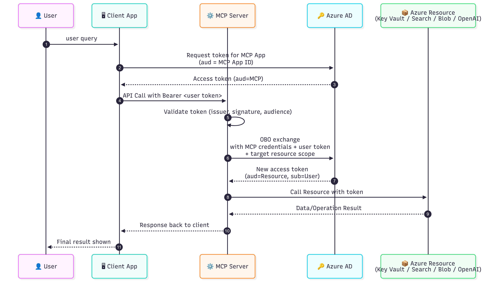

# **MMCTAgent MCP Server**

A powerful Model Context Protocol (MCP) server that exposes MMCT (Multi-modal Critical Thinking) Agent capabilities through a standardized interface. Built with FastMCP for seamless integration with AI agents and applications.

## **Quick Start**

<details>
<summary>Requirements Installation</summary>

Ensure to install the requirements from the `requirements.txt` present in the base directory.

</details>

<details>

<summary>Start the Server</summary>

```python
python main.py
```

Server runs on `http://0.0.0.0:8000` by default on `streamable-http` transport. 

Learn more about the [MCP transport configuration](https://deepwiki.com/jlowin/fastmcp/7.1-transport-protocols).
</details>

<details>

<summary>Test Connection</summary>

You can test out individual tool using the `client.py`.

```bash
python client.py
```
</details>

<details>

<summary>Available Tools</summary>

### 1. **Video Agent Tool** (`video_agent_tool`)

**Purpose**: Answer natural language questions over ingested video content through MMCT reasoning.

**Key Features**:

- Multi-modal reasoning (transcript + visual frames)
- Optional critic agent for enhanced accuracy
- Automatic document retrieval from vector database

```python
# Example usage
{
    "query": "What is the main topic discussed?",
    "index_name": "video-knowledge-base",
    "video_id": "optional-video-id",
    "use_computer_vision_tool": True,
    "use_critic_agent": True,
    "top_n": 1
}
```

### 2. **Video Ingestion Tool** (`video_ingestion_tool`)

**Purpose**: Process and index video content for searchability  
**Key Features**:

- Multi-language transcription support
- Frame extraction and visual analysis
- Automatic metadata enrichment

```python
# Example usage
{
    "video_url": "https://example.com/video.mp4",
    "file_name": "video.mp4",
    "index_name": "my-video-index",
    "language": "en-US",
    "transcription_service": "whisper",
    "use_computer_vision_tool": False,
    "frame_stacking_grid_size": 4
}
```

### 3. **Image Agent Tool** (`image_agent_tool`)

**Purpose**: Analyze images and answer questions about visual content  
**Key Features**:

- Multiple analysis modes (ocr, Object Detection, vit, Recognition)
- Optional critic agent validation
- Automatic image download and cleanup

```python
# Example usage
{
    "image_url": "https://example.com/image.jpg",
    "query": "What text is visible in this image?",
    "tools": ["ocr", "object_detection"],
    "use_critic_agent": True
}
```

### 4. **Knowledge Base Tool** (`kb_tool`)

**Purpose**: Search and retrieve structured metadata from indexed content  
**Key Features**:

- Multiple search modes (full-text, vector, semantic)
- Advanced filtering capabilities
- Flexible field selection

```python
# Example usage
{
    "request": {
        "query": "machine learning concepts",
        "query_type": "semantic",
        "index_name": "knowledge-base",
        "k": 10,
        "filters": {
            "category": "Education",
            "time_from": "2024-01-01T00:00:00Z"
        },
        "select": ["category", "subject", "hash_video_id"]
    }
}
```

### Search Modes

| Mode | Description | Use Case |
|------|-------------|----------|
| `full` | Keyword-based search | Exact term matching |
| `vector` | Embedding similarity | Semantic similarity |
| `semantic` | Natural language understanding | Complex queries |

</details>

<details>

<summary>Configuration</summary>

The server automatically configures providers through MMCTConfig:

- **Search Provider**: Azure AI Search integration
- **Embedding Provider**: Vector embedding generation
- **Transcription Services**: Multiple ASR options

</details>

<details>

<summary>Project Structure</summary>

```py
mcp_server/
├── server.py                # FastMCP server instance
├── main.py                  # Server entry point
├── client.py                # Test client with examples
├── tools/                   # MCP tool implementations
│   ├── video_agent_tool.py
│   ├── image_agent_tool.py
│   ├── video_ingestion_tool.py
│   └── kb_tool.py
├── schemas/                 # Pydantic schemas
└── notebooks/               # Usage examples
```

</details>

## **Integration with Agents**

Integration of `AutoGen` Agent with MCP server has been provided in the `notebooks/autogen_mcp_example.ipynb`. You can understand the connection setup with the AutoGen.
Below are the links which showcase the integration of MCP server tools with agents.
- [AutoGen Docs](https://microsoft.github.io/autogen/stable/reference/python/autogen_ext.tools.mcp.html#module-autogen_ext.tools.mcp)
- [MCP tools integration in Semantic Kernel](https://valentinaalto.medium.com/leverage-mcp-tools-with-semantic-kernel-agents-36120136832d)


## **Deployment of Resources & MCP server**

For the deployment of MCP server you can visit the `MMCT Infrastructure Deployment Guide` present in the `infra` folder. 

Required Resources are on Azure Cloud:
1. Azure Storage Account
2. Azure AI Search Service
3. Azure Speech Service/Azure OpenAI Whisper
4. Azure OpenAI - Chat Model, Embedding Model and OpenAI Whisper (if not using Azure Speech Service)

You can utilize any service to deploy the MCP server such as Azure App Service, Azure Container Apps etc. Ensure to validate the required role assignment if using [Microsoft Intra Id Access](https://learn.microsoft.com/en-us/entra/identity).

## **Multi-Tenant Setup for MCP server**

This section covers the way to authorize the MCP server so it can access the respective client's resources when receiving the incoming request.

  The OBO (On-Behalf-Of) flow describes the scenario of a web API using an identity other than its own to call another web API. Referred to as delegation in OAuth, the intent is to pass a user's identity and permissions through the request chain. [[source]](https://learn.microsoft.com/en-us/entra/identity-platform/v2-oauth2-on-behalf-of-flow)

For our MCP server the OBO Flow Auth representation is below:

<p align="center">
    
</p>

The following configuration steps must be performed:
1. **MCP App Registration (in MCP Tenant)**
    - Create an App Registration for the MCP Server in its own tenant.
    - This app registration represents the MCP Server’s identity in Azure AD.
    - Ensure a **Service Principal** is created for it in the MCP Tenant.
2. **Enable Multi-Tenant Access**
    - In the MCP App Registration, set the app to **multi-tenant** so that it can accept tokens from other tenants (e.g., the client’s tenant).
    - This allows the MCP app to be consented/used outside its home tenant.
3. **Create Service Principal in Client Tenant**
    - When the Agentic Client first requests access, an **MCP App Service Principal** (an instance of the MCP App Registration) is created in the **Client’s Tenant**.
    - This requires **admin consent** in the client’s tenant.
4. **Grant Required API Permissions**
    - Assign the correct API permissions / role assignments in the client’s tenant for the MCP Service Principal.
    - For example, allow it to access Azure resources (Key Vault, AI Search, Blob, OpenAI) on behalf of the user.
    - Ensure proper whitelisting / RBAC setup in the client’s Azure AD.
5. **Consistent Resource Access via Key Vault**
    - Resource names (endpoints) may vary across tenants, e.g.:
      - `AZURE_OPENAI_ENDPOINT`
      - `AZURE_SEARCH_ENDPOINT` 
    - To standardize, the **MCP Server reads all endpoints/secrets from a Key Vault**, where environment variable keys are always consistent.
    - This ensures that, regardless of client tenant naming differences, the MCP Server always looks up the same variable name to access the correct resource endpoint.
</details>