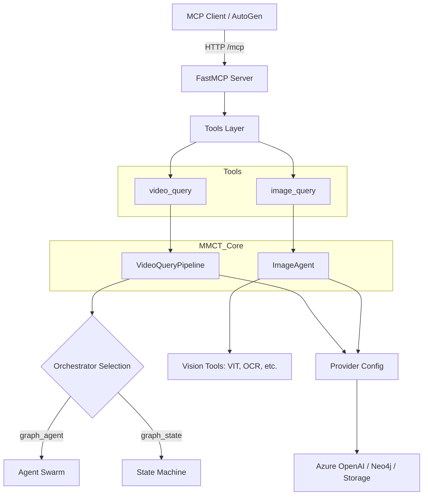

# MMCT Agent MCP Server

The **MMCT Agent MCP Server** exposes the Multi-Modal Critical Thinking (MMCT) framework as a standardized set of tools via the [Model Context Protocol (MCP)](https://modelcontextprotocol.io/). It enables AI agents (like Claude Desktop, Cursor, or AutoGen) to perform advanced video reasoning and image analysis over a simple HTTP interface.

## Key Features

- **Unified Video Query**: Select between agentic swarm reasoning (`graph_agent`) and deterministic state machine extraction (`graph_state`).
- **Advanced Image Analysis**: Integrated vision tools for fine-grained details (`vit`), general recognition (`recog`), object detection, and OCR.
- **Provider Agnostic**: Configured via a centralized provider system supporting Azure OpenAI, Neo4j, and more.
- **Streamable HTTP**: Uses FastMCP's streamable HTTP transport for efficient, real-time feedback.

---

## Architecture


```mermaid
graph TD
    Client["MCP Client / AutoGen"] -- "HTTP /mcp" --> Server["FastMCP Server"]
    Server --> ToolsLayer["Tools Layer"]
    
    subgraph Tools
        VQ["video_query"]
        IQ["image_query"]
    end
    
    ToolsLayer --> VQ
    ToolsLayer --> IQ
    
    VQ --> VQP["VideoQueryPipeline"]
    IQ --> IA["ImageAgent"]
    
    VQP --> Orchestrator{"Orchestrator Selection"}
    Orchestrator -- "graph_agent" --> Swarm["Agent Swarm"]
    Orchestrator -- "graph_state" --> SM["State Machine"]
    
    IA --> VisionTools["Vision Tools: VIT, OCR, etc."]
    
    subgraph MMCT_Core
        VQP
        IA
    end
    
    VQP --> Providers["Provider Config"]
    IA --> Providers
    
    Providers --> Services["Azure OpenAI / Neo4j / Storage"]
```

---

## Quick Start

### 1. Prerequisites

- Python 3.10+
- Install dependencies: `pip install .` in the project root.
- Configure Azure credentials (`az login`).

### 2. Configuration

Ensure your `.env` file in the project root is populated with the necessary service endpoints and keys. The server uses the centralized `config/provider_config.py` as its single source of truth.

```env
# Example .env subset
llm_endpoint=https://<resource>.openai.azure.com/
llm_deployment_name=gpt-4o
neo4j_password=<password>
storage_account_name=<account>

# Optional: enable data retrieval endpoints (transcript & frames)
ENABLE_DATA_APIS=true
```

### 3. Start the Server

```bash
python -m mcp_server.main
```

The server will be available at `http://0.0.0.0:8000/mcp`.

---

## Available Tools

### `video_query`
Query ingested video content using specialized MMCT pipelines.

| Parameter | Type | Required | Description |
| :--- | :--- | :--- | :--- |
| `query` | `string` | Yes | Natural language question about the video. |
| `video_id` | `string` | No | Scope query to a single video ID. |
| `video_ids` | `list` | No | Scope query across multiple video IDs. |
| `mode` | `enum` | No | `graph_state` (fast/deterministic) or `graph_agent` (complex reasoning). |

### `image_query`
Analyze images and answer questions about their content.

| Parameter | Type | Required | Description |
| :--- | :--- | :--- | :--- |
| `query` | `string` | Yes | Question or instruction about the image. |
| `image_path` | `string` | Yes | Local file path or public URL. |
| `tools` | `list` | No | Vision tools to use: `vit`, `recog`, `object_detection`, `ocr`. |
| `use_critic_agent`| `boolean`| No | Enable reflective feedback (default: `false`). |

---

## Data Retrieval Endpoints

> **Gated by environment variable:** Set `ENABLE_DATA_APIS=true` to enable these endpoints. They are **not** loaded by default.

### `GET /lively/transcript/{video_id}`
Returns the SRT transcript for a video as plain text.

| Parameter | In | Type | Required | Description |
| :--- | :--- | :--- | :--- | :--- |
| `video_id` | path | `string` | Yes | The video identifier. |

**Responses:** `200` plain text SRT, `404` transcript not found, `500` internal error.

### `GET /lively/frames/{video_id}?ts={timestamp}`
Returns base64-encoded JPEG frames at `ts-1`, `ts`, and `ts+1` (seconds).

| Parameter | In | Type | Required | Description |
| :--- | :--- | :--- | :--- | :--- |
| `video_id` | path | `string` | Yes | The video identifier. |
| `ts` | query | `integer` | Yes | Timestamp in seconds (≥ 0). |

**Responses:** `200` JSON with `{ video_id, requested_ts, frames: { "<second>": "<base64>" } }`, `400` invalid ts, `404` no frames found.

---

## Integration Examples

### AutoGen
See [notebooks/autogen_mcp_example.ipynb](notebooks/autogen_mcp_example.ipynb) for a complete example of connecting an AutoGen AssistantAgent to this server.

### Claude Desktop / Cursor
Add the following to your MCP settings (`claude_desktop_config.json`):

```json
{
  "mcpServers": {
    "mmct-agent": {
      "url": "http://localhost:8000/mcp"
    }
  }
}
```

---

## ACL Caller-Identity Header

When the server is deployed with `ACL_ENABLED=true`, every `video_query`
tool call must arrive with a caller-identity HTTP header so the
configured access-check callback can decide which videos the caller may
see. The header carries an opaque JSON object — its shape is a private
contract between the deployer and the ACL callback (e.g. an MS Graph
token plus the user's email; or a username plus a tenant id; or
whatever the callback expects).

**Header name:** `MMCT-User-Identifier-Context`

**Header value:** a JSON-encoded object. Example:

```
MMCT-User-Identifier-Context: {"email":"alice@example.com","graph_token":"eyJ..."}
```

Semantics:

* Missing/empty header — request proceeds. With `ACL_ENABLED=true`, the
  pipeline raises a configuration error per tool call (fail-fast).
* Malformed JSON or non-object value — middleware returns HTTP 400
  immediately.

The header is read by an ASGI middleware before the JSON-RPC dispatch,
so the value never appears in the LLM-visible tool schema. Trusted
client apps inject it at the dispatch layer; the LLM does not need to
(and should not) author it.

Custom-header config in MCP clients:

```json
{
  "mcpServers": {
    "mmct-agent": {
      "url": "http://localhost:8000/mcp",
      "headers": {
        "MMCT-User-Identifier-Context": "{\"email\":\"alice@example.com\",\"graph_token\":\"...\"}"
      }
    }
  }
}
```

---

## Testing

A lightweight test client is provided to verify server registration and tool execution:

```bash
python -m mcp_server.test_client
```
