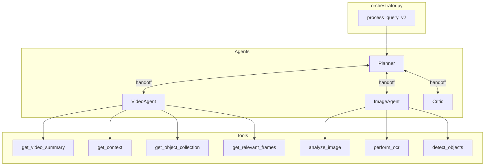
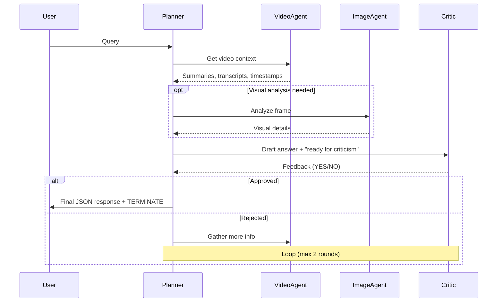

# V2 Query Orchestration Module

A multi-agent Video & Image Q&A system built on [AutoGen AgentChat](https://microsoft.github.io/autogen/).

## Architecture Overview



## File Structure

| File | Purpose |
|------|---------|
| `orchestrator.py` | Main entry point. Initializes agents, manages Swarm team, handles streaming output |
| `schemas.py` | Pydantic models: `V2AgentResponse`, `CitationSource`, `TokenUsage` |
| `agents/planner.py` | Orchestrator agent - coordinates all agents, drafts final answers |
| `agents/video_agent.py` | Retrieves video summaries, transcripts, object data, frame timestamps |
| `agents/image_agent.py` | Analyzes images/frames using vision tools (ViT, OCR, object detection) |
| `agents/critic.py` | Validates Planner's draft answers for completeness and grounding |

## Query Flow



## Key Features

### Context Management
Each agent has a `BufferedChatCompletionContext` to prevent context explosion during multi-turn loops:

```python
PLANNER_BUFFER_SIZE = 15   # Orchestration needs more context
CRITIC_BUFFER_SIZE = 10    # Just needs recent draft
VIDEO_AGENT_BUFFER_SIZE = 12
IMAGE_AGENT_BUFFER_SIZE = 10
```

### Response Format
Final responses use `V2AgentResponse` with inline citations:

```json
{
  "response": "The tradition originated in Germany [1] and spread to England [2].",
  "answer_found": true,
  "sources": [
    {"citation_id": 1, "video_id": "abc123", "start_time": "00:01:30", "end_time": "00:02:15"},
    {"citation_id": 2, "video_id": "abc123", "start_time": "00:05:00", "end_time": "00:05:45"}
  ]
}
```

### Agent Responsibilities

| Agent | Role | Tools |
|-------|------|-------|
| **Planner** | Orchestrates workflow, drafts answers, formats citations | None (delegates) |
| **VideoAgent** | Text/metadata retrieval from videos | `get_video_summary`, `get_context`, `get_object_collection`, `get_relevant_frames` |
| **ImageAgent** | Visual frame analysis | `analyze_image`, `detect_objects`, `perform_ocr`, `recognize_entities` |
| **Critic** | Validates grounding & completeness | None (evaluates from context) |

## Usage

```python
from mmct.v2.orchestrator import process_query_v2

result = await process_query_v2(
    query="What is shown at the 2 minute mark?",
    video_provider=video_config,
    image_provider=image_config,
    video_id="optional_video_id",
    use_critic=True,      # Enable validation loop
    use_console=True      # Print streaming output
)
```

## Swarm Configuration

- **Termination**: `TextMentionTermination("TERMINATE")`
- **Safety limit**: `max_turns=20`
- **Handoff pattern**: Agents explicitly transfer control via `handoffs` parameter
