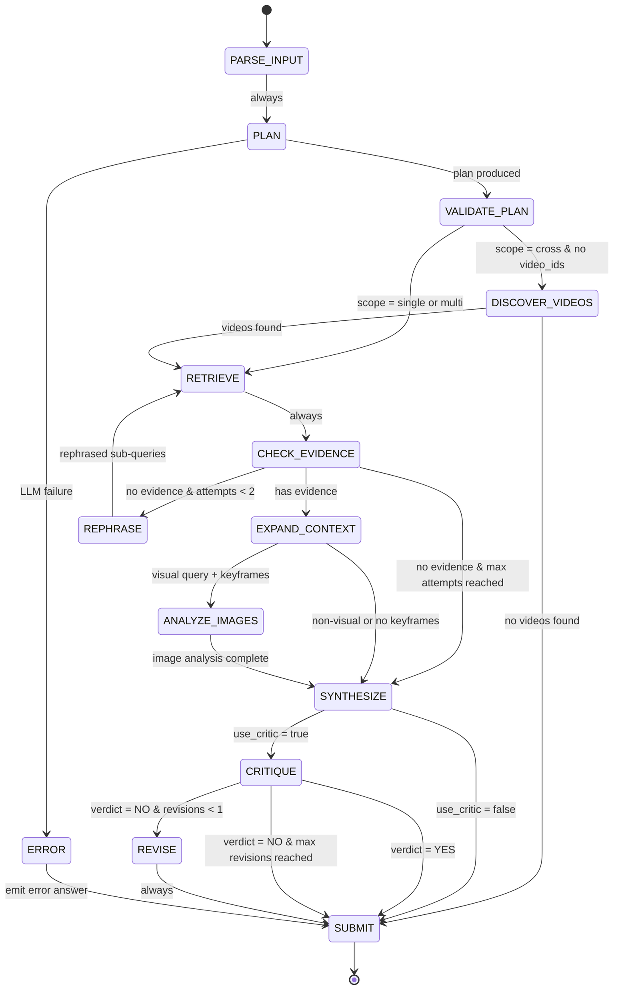
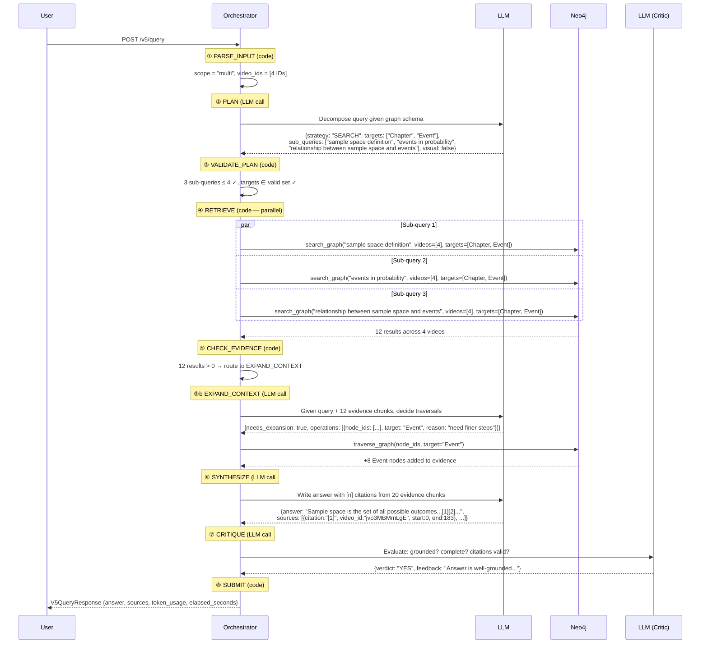

# V5 Query Pipeline — State Machine Architecture

A deterministic, code-controlled query pipeline that replaces V4's LLM-driven AutoGen Swarm routing. LLMs are called **only** for intelligence tasks (planning, synthesis, critique) — all routing, tool selection, parallelism, and retries are enforced by code.

## State Machine Overview



## Who Does What — LLM vs Code

| State | LLM? | What Happens |
|---|---|---|
| `PARSE_INPUT` | ❌ Code | Determine scope (`single` / `multi` / `cross`) from `video_id` / `video_ids` params |
| `PLAN` | ✅ LLM | Decompose query → `{strategy, targets, sub_queries, visual, limit}` |
| `VALIDATE_PLAN` | ❌ Code | Clamp sub-queries to [1, 4], validate targets against allowed set, enforce strategy |
| `DISCOVER_VIDEOS` | ❌ Code | `find_relevant_videos()` via Neo4j — only when scope = `cross` |
| `RETRIEVE` | ❌ Code | `asyncio.gather()` parallel `search_graph` per sub-query |
| `CHECK_EVIDENCE` | ❌ Code | `len(results) == 0` check → retry or proceed |
| `EXPAND_CONTEXT` | ✅ LLM | Decide if graph traversals needed (UP/DOWN/SIBLING) and execute them |
| `REPHRASE` | ✅ LLM | Rephrase failed sub-queries with different terminology |
| `ANALYZE_IMAGES` | ✅ ViT | Parallel ViT analysis per keyframe (image model, not text LLM) |
| `SYNTHESIZE` | ✅ LLM | Write answer with `[n]` citations grounded on retrieved evidence |
| `CRITIQUE` | ✅ LLM | Evaluate answer: grounded? complete? citations valid? |
| `REVISE` | ✅ LLM | Rewrite answer incorporating critic feedback |
| `SUBMIT` | ❌ Code | Build `V5QueryResponse` |

## Sample Query Walkthrough

> **Query:** *"How do the concepts of sample space and events interrelate across the lectures?"*
> **Params:** `video_ids: ["jvo3MBMmLgE", "My1UtlJnp7k", "1d-6FI33HmY", "cyu51WEwo7w"]`, `use_critic: true`



**Result: Up to 4 LLM calls** (Plan → Expand Context → Synthesize → Critique) — all routing and parallelism handled by code.

## Happy Path LLM Call Count

| Scenario | LLM Calls | Path |
|---|---|---|
| No critic, no expansion | **2** | PLAN → SYNTHESIZE |
| No critic, with expansion | **3** | PLAN → EXPAND_CONTEXT → SYNTHESIZE |
| With critic (accepted) | **3-4** | PLAN → [EXPAND_CONTEXT] → SYNTHESIZE → CRITIQUE |
| With critic (rejected, revised) | **4-5** | PLAN → [EXPAND_CONTEXT] → SYNTHESIZE → CRITIQUE → REVISE |
| Empty retrieval + rephrase | **+1** | adds REPHRASE before SYNTHESIZE |
| Visual query | **+N** | adds N ViT calls in ANALYZE_IMAGES |

## Constants (Hard Limits)

| Constant | Value | Enforced In |
|---|---|---|
| `MAX_SUB_QUERIES` | 4 | `VALIDATE_PLAN` — clamps LLM output |
| `MIN_SUB_QUERIES` | 1 | `VALIDATE_PLAN` — ensures at least one |
| `MAX_RETRIEVE_ATTEMPTS` | 2 | `CHECK_EVIDENCE` — retry gate |
| `MAX_REVISE_ATTEMPTS` | 1 | `CRITIQUE` — revision gate |

## Module Structure

```
mmct/v5/
├── README.md               ← you are here
├── __init__.py              # Public exports
├── state_machine.py         # QueryState enum, QueryContext, constants
├── orchestrator.py          # State machine loop + all state handlers
├── schemas.py               # V5QueryResponse, CitationSource
├── llm/
│   └── client.py            # StructuredLLMClient (call_typed → Pydantic)
├── prompts/
│   ├── planner.py           # PLAN, SYNTHESIZE, REPHRASE prompts + models
│   ├── critic.py            # CRITIQUE prompt + CritiqueResult model
│   └── image_analyst.py     # Image analysis summary prompt
├── executors/
│   ├── retrieval.py         # search (parallel), overview, traverse, search_keyframes
│   ├── video_discovery.py   # find_relevant_videos wrapper
│   └── image_analysis.py    # ViT batch analysis + blob download
├── query/
│   └── neo4j_provider.py    # Neo4j HNSW vector search + graph traversal
└── utils/
    ├── toon_encoder.py      # Content encoding
    └── output_formatter.py  # Output formatting mixin
```

## API Endpoints

| Method | Path | Description |
|---|---|---|
| `POST` | `/v5/query` | Synchronous query → `V5QueryResponse` |
| `POST` | `/v5/query/stream` | SSE streaming with state transition events |

### Example Request

```bash
curl -X POST "http://localhost:8000/v5/query" \
  -H "Content-Type: application/json" \
  -d '{
    "query": "How do sample space and events relate in probability theory?",
    "video_ids": ["jvo3MBMmLgE", "My1UtlJnp7k", "1d-6FI33HmY", "cyu51WEwo7w"],
    "use_critic": true
  }'
```

## V4 vs V5 Comparison

| Decision | V4 (LLM decides) | V5 (Code enforces) |
|---|---|---|
| Video scope | LLM reads prompt | `if video_ids: scope="multi"` |
| Tool selection | LLM picks tools | `plan.strategy → tool mapping` |
| Parallel execution | Prompt says "batch" | `asyncio.gather()` |
| `find_relevant_videos` guard | Prompt says "don't" | Only called when `scope == "cross"` |
| Sub-query count | Prompt says "2-4" | `clamp(len(sqs), 1, 4)` |
| Target validation | Prompt says valid types | `assert t in VALID_TARGETS` |
| Retry on empty | Prompt says "try again" | `if empty and attempts < MAX` |
| Agent routing | HandoffMessage | `match state:` |
| Critic loops | CountingHandoff(2) | `revise_attempts < 1` |
